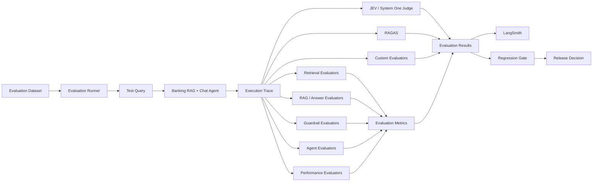
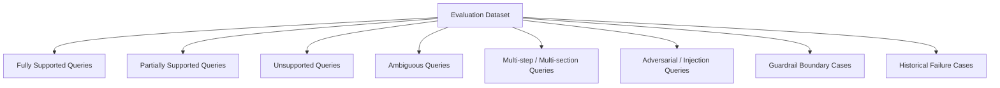
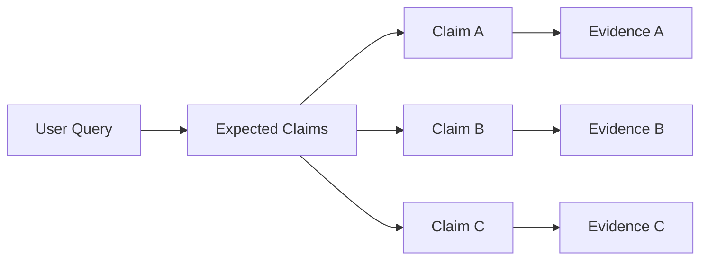
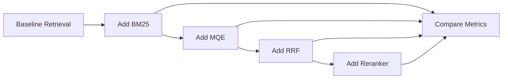
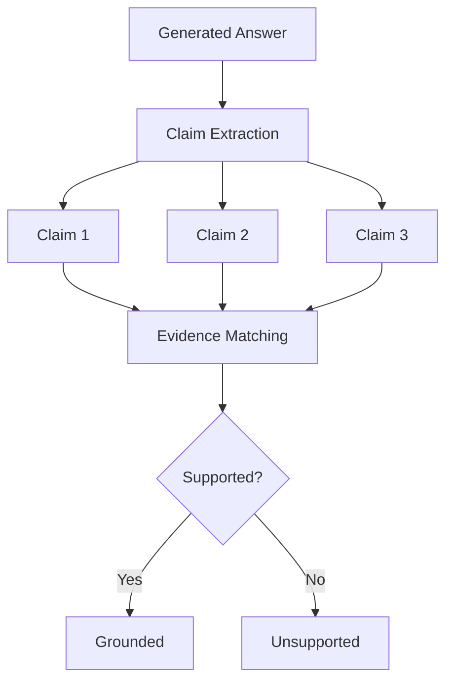
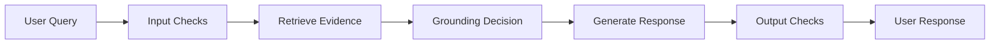
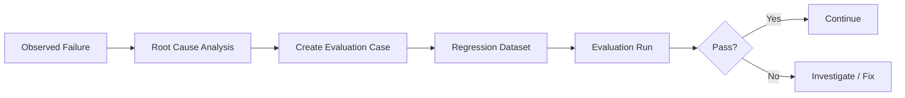
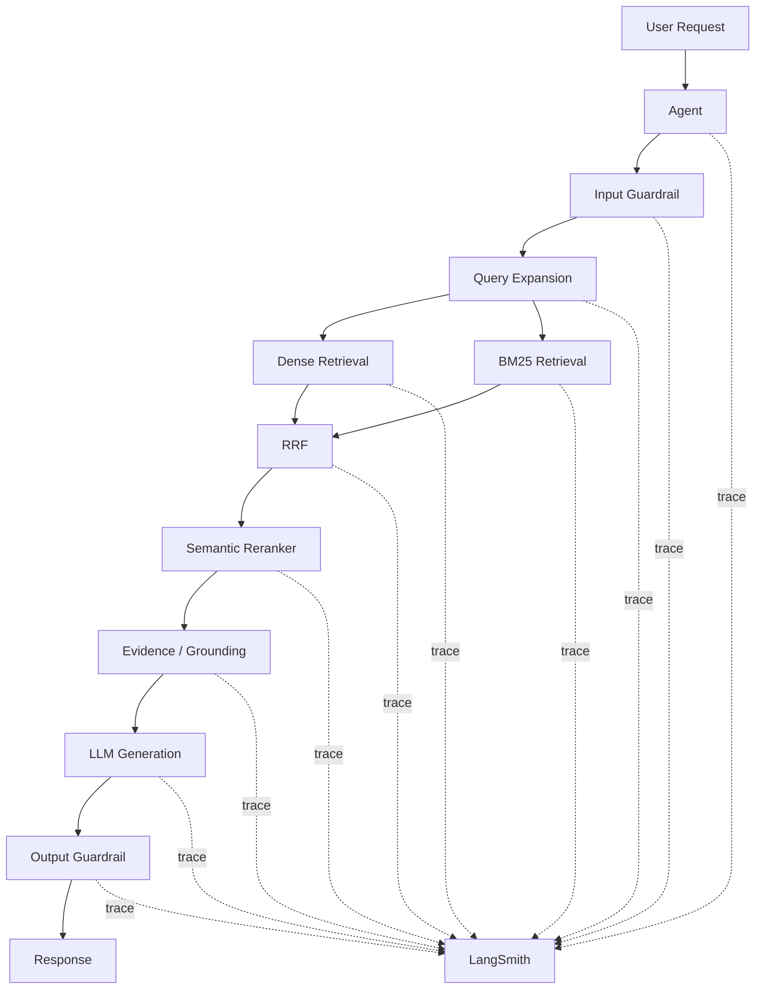
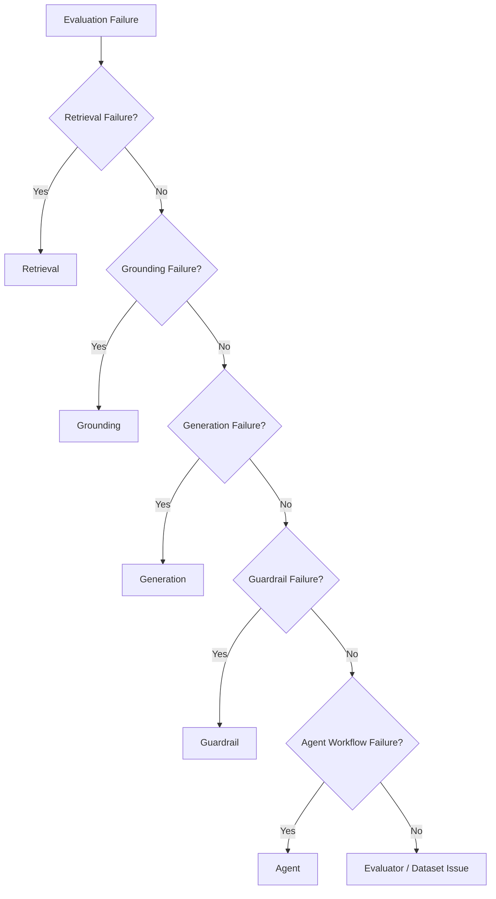
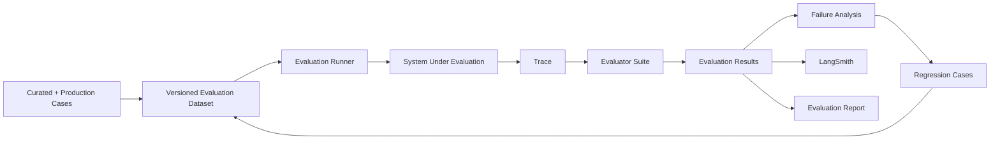

# Advanced RAG — Banking: Evaluation Design

## 1. Purpose

This document defines the evaluation architecture for the Advanced RAG Banking system.

The evaluation system exists to answer a specific question:

> **Does the system provide answers that are correct, supported by the governed banking knowledge base, appropriately scoped, and compliant with the system's response policies?**

Evaluation covers the complete answer-producing pipeline rather than only the final LLM response.

The evaluation architecture combines:

- Retrieval evaluation
- RAG answer evaluation
- Claim-level grounding evaluation
- Guardrail evaluation
- Agent/workflow evaluation
- End-to-end evaluation
- Regression testing
- LLM-as-a-judge evaluation
- RAGAS metrics
- Custom deterministic evaluators
- JEV / System One judge evaluation
- LangSmith tracing and experiment tracking

---

# 2. Evaluation Goals

The evaluation framework must measure the following dimensions.

| Dimension | What it measures |
|---|---|
| Retrieval quality | Whether the system retrieves the evidence required to answer the query |
| Retrieval recall | Whether relevant knowledge is present in the retrieved candidate set |
| Ranking quality | Whether the most useful evidence is ranked near the top |
| Context quality | Whether the final context is relevant, sufficient, and non-redundant |
| Groundedness | Whether answer claims are supported by retrieved evidence |
| Answer correctness | Whether the answer accurately reflects the supported banking information |
| Completeness | Whether the answer covers the supported parts of the user's request |
| Scope adherence | Whether the system avoids answering beyond the knowledge base |
| Partial-support behavior | Whether mixed supported/unsupported questions are handled correctly |
| Clarification behavior | Whether clarification is requested when the available evidence is insufficient |
| Guardrail effectiveness | Whether unsafe, unsupported, or adversarial requests are handled correctly |
| Agent behavior | Whether the agent follows the intended workflow and does not perform out-of-scope actions |
| Consistency | Whether equivalent inputs produce appropriately consistent results |
| Latency | Whether individual pipeline stages and end-to-end responses meet targets |
| Reliability | Whether failures, retries, and degraded dependencies are handled predictably |

---

# 3. Evaluation Architecture



The evaluation system is intentionally separate from the production response path.

Production requests generate traces and telemetry, while controlled evaluation runs execute curated datasets and evaluators.

---

# 4. Evaluation Layers

Evaluation is divided into five primary layers.

| Layer | Primary Responsibility |
|---|---|
| Retrieval Evaluation | Determine whether relevant evidence was retrieved and correctly ranked |
| Grounding / RAG Evaluation | Determine whether the response is supported and correct |
| Guardrail Evaluation | Determine whether system safety and scope policies are correctly enforced |
| Agent Evaluation | Determine whether the agent follows the intended workflow and tool/action boundaries |
| End-to-End Evaluation | Measure the complete user-visible behavior |

These layers should be independently measurable so that a poor final answer can be traced to the responsible pipeline stage.

---

# 5. Evaluation Dataset

The evaluation dataset is a governed collection of test cases.

Each test case should contain enough information to evaluate the expected behavior without depending exclusively on an LLM judge.

## 5.1 Dataset Categories



### Fully Supported

Questions for which the knowledge base contains sufficient evidence for a complete answer.

### Partially Supported

Questions containing multiple claims where only some are supported by the knowledge base.

### Unsupported

Questions for which the governed knowledge base does not contain sufficient information.

### Ambiguous

Questions where clarification is required before a reliable answer can be produced.

### Multi-section / Multi-hop

Questions requiring evidence from multiple knowledge sections or documents.

### Adversarial

Inputs designed to test prompt injection, instruction conflicts, context manipulation, or attempts to force unsupported answers.

### Historical Failure Cases

Previously observed failures that must remain part of the regression suite.

---

# 6. Evaluation Case Schema

A test case should conceptually contain:

```yaml
id: banking_eval_001
category: fully_supported

query: "What are the eligibility requirements for the product?"

expected_behavior: answer

expected_answer:
  - "..."

required_sources:
  - document_id
  - section_id

expected_claims:
  - claim: "..."
    supported_by:
      - source_id

forbidden_claims:
  - "..."

metadata:
  product: example_product
  version: "..."
  difficulty: medium
```

Not every evaluation case needs every field.

For example, an unsupported-query case may intentionally omit `expected_answer` and instead specify:

```yaml
expected_behavior: unsupported
```

---

# 7. Ground Truth Strategy

Ground truth should be created at multiple levels.

## 7.1 Document-Level Ground Truth

Defines which documents are relevant to a query.

## 7.2 Section-Level Ground Truth

Defines which sections contain the required evidence.

## 7.3 Claim-Level Ground Truth

Defines the individual claims that a correct answer should contain and the evidence supporting each claim.

Claim-level ground truth is particularly important for:

- Partial answers
- Multi-part questions
- Hallucination detection
- Completeness evaluation
- Unsupported claim detection



---

# 8. Retrieval Evaluation

Retrieval evaluation measures the retrieval subsystem independently from answer generation.

The retrieval pipeline includes:

```text
Query
  ↓
MQE
  ↓
Dense Retrieval + BM25
  ↓
RRF
  ↓
Candidate Set
  ↓
Semantic Reranking
  ↓
Final Context
```

## 8.1 Retrieval Metrics

### Recall@K

Measures whether relevant evidence appears within the top K retrieved results.

```text
Recall@K =
relevant retrieved items / total relevant items
```

Important values should include:

- Recall@1
- Recall@3
- Recall@5
- Recall@10
- Recall@20

The exact production K values should be finalized during benchmarking.

### Precision@K

Measures the proportion of retrieved items that are relevant.

### MRR

Mean Reciprocal Rank measures how early the first relevant result appears.

### nDCG@K

Measures ranking quality while accounting for graded relevance.

### Hit Rate

Measures whether at least one relevant result is retrieved.

---

# 9. Retrieval Ablation Evaluation

Because the architecture uses multiple retrieval techniques, the evaluation framework should support controlled ablation experiments.

Examples:

```text
Dense only
BM25 only
Dense + BM25
Dense + BM25 + MQE
Dense + BM25 + MQE + RRF
Dense + BM25 + MQE + RRF + Reranker
```

This allows each component's contribution to be measured independently.



The objective is not to assume that every component improves every query type, but to measure the effect empirically.

---

# 10. RAGAS Evaluation

RAGAS will be used as one evaluation layer rather than the sole source of truth.

Relevant RAGAS-style measurements include:

| Metric | Purpose |
|---|---|
| Context Precision | Measures whether retrieved context is relevant |
| Context Recall | Measures whether required information was retrieved |
| Faithfulness | Measures whether the response is supported by retrieved context |
| Answer Relevancy | Measures whether the response addresses the question |
| Answer Correctness | Measures agreement with the expected answer where applicable |

RAGAS results should be combined with deterministic and custom evaluators because the banking system has policies that generic RAG metrics do not fully capture.

---

# 11. Custom Evaluation

Custom evaluators are required for banking-specific behavior.

## 11.1 KB-Only Evaluator

Checks whether every substantive banking claim can be supported by the governed knowledge base.

```text
For each answer claim:
    identify supporting evidence
    if no supporting evidence:
        mark claim as unsupported
```

## 11.2 Partial-Support Evaluator

For mixed queries:

```text
Supported claims → answer
Unsupported claims → do not answer as facts
Clarification required → ask clarification when appropriate
```

The evaluator verifies that the model does not convert an unsupported portion into a confident answer.

## 11.3 Claim Coverage Evaluator

Measures:

```text
supported expected claims answered
----------------------------------
supported expected claims
```

## 11.4 Unsupported Claim Rate

Measures the percentage of substantive answer claims that lack supporting evidence.

This is a critical metric for the system's KB-only policy.

## 11.5 Scope Adherence Evaluator

Checks whether the response stays within the intended banking knowledge scope.

## 11.6 Refusal / Clarification Correctness

Determines whether the system:

- answers supported questions,
- rejects unsupported questions,
- provides supported portions of partially supported questions,
- requests clarification when required.

---

# 12. Claim-Level Evaluation

The final answer should be decomposed into atomic claims where practical.



Claim-level evaluation allows the system to distinguish:

```text
Correct answer
Partially correct answer
Correct evidence + incomplete answer
Unsupported claim
Hallucinated claim
Correct refusal
Incorrect refusal
```

This is more informative than evaluating the complete answer using a single score.

---

# 13. Guardrail Evaluation

Guardrail evaluation verifies that each guardrail layer behaves according to its defined policy.

## 13.1 Input Guardrail Tests

Test cases should include:

- Normal banking questions
- Out-of-scope requests
- Prompt injection attempts
- Instruction override attempts
- Requests to reveal system instructions
- Malformed inputs
- Extremely long inputs
- Adversarial phrasing

## 13.2 Retrieval Guardrail Tests

Verify that:

- Retrieved content is treated as data
- Retrieved documents cannot override system instructions
- Invalid or unsuitable context is excluded
- Conflicting or outdated knowledge is handled according to knowledge governance rules

## 13.3 Evidence / Grounding Tests

Verify:

- Unsupported claims are rejected
- Partially supported questions are handled correctly
- Evidence is sufficient for the generated claims
- Answers do not rely on model knowledge outside the KB

## 13.4 Output Guardrail Tests

Verify:

- Unsupported banking claims are blocked
- Required clarification is preserved
- Partial-support policy is respected
- Responses remain within system scope

---

# 14. Agent Evaluation

The agent is intentionally limited to resolving user queries.

Agent evaluation therefore focuses on controlled behavior rather than broad autonomous capability.

## 14.1 Workflow Adherence

Verify that the agent follows the intended workflow:



## 14.2 Agent Boundary Tests

Verify that the agent does not:

- Perform banking transactions
- Modify accounts
- Execute unrelated external actions
- Invent tools
- Bypass guardrails
- Treat conversation memory as authoritative banking knowledge

## 14.3 Agent Failure Tests

Evaluate:

- Retrieval failure
- LLM failure
- Timeout
- Empty retrieval result
- Conflicting evidence
- Guardrail rejection
- Malformed tool output
- Provider failure

---

# 15. Judge Evaluation — JEV / System One

JEV / System One will be used as a judge for dimensions that are difficult to evaluate deterministically.

Potential judge dimensions include:

- Answer correctness
- Answer quality
- Relevance
- Grounding quality
- Completeness
- Policy adherence
- Clarification appropriateness

The judge must not become the sole source of truth.

## Judge Evaluation Principle

```text
System Output
      ↓
Deterministic Evaluators
      +
RAGAS
      +
JEV / System One
      ↓
Combined Evaluation Result
```

Judge prompts should provide:

- User query
- Retrieved evidence
- Generated answer
- Expected behavior
- Evaluation criteria

The judge should not receive unnecessary information that could influence the evaluation.

---

# 16. Judge Calibration

Before using JEV as a release gate, it must itself be evaluated.

Create a curated calibration set containing:

- Clearly correct answers
- Clearly incorrect answers
- Hallucinated answers
- Partially correct answers
- Correct refusals
- Incorrect refusals
- Correct clarification
- Incorrect clarification

Human-reviewed labels should be treated as the reference for judge calibration.

Measure:

- Agreement with reference labels
- False positives
- False negatives
- Consistency across repeated evaluations

Judge results should be versioned because changing the judge model or prompt can change evaluation outcomes.

---

# 17. Composite Evaluation Model

No single metric should determine system quality.

A run should produce a multidimensional evaluation report.

Example:

```text
Retrieval
├── Recall@5
├── Recall@10
├── MRR
└── nDCG@10

Grounding
├── Faithfulness
├── Unsupported Claim Rate
└── Claim Coverage

Answer
├── Answer Correctness
├── Answer Relevancy
└── Completeness

Policy
├── KB-only compliance
├── Partial-support compliance
├── Clarification correctness
└── Guardrail pass rate

Agent
├── Workflow adherence
├── Boundary compliance
└── Failure handling

Performance
├── Retrieval latency
├── Reranking latency
├── LLM latency
└── End-to-end latency
```

---

# 18. Evaluation Gates

Evaluation gates prevent regressions from silently reaching later environments.

Example gates:

| Gate | Purpose |
|---|---|
| Retrieval gate | Prevent significant retrieval-quality regression |
| Grounding gate | Prevent unsupported answer claims |
| Guardrail gate | Prevent policy bypass |
| Agent gate | Prevent workflow/boundary regression |
| Regression gate | Prevent previously fixed failures from returning |
| Performance gate | Detect unacceptable latency regression |

Thresholds should be established empirically during benchmarking rather than arbitrarily fixed before baseline measurements exist.

---

# 19. Regression Evaluation

Every production-significant failure should have the option to become a regression case.



Regression cases should be retained even after the underlying implementation is fixed.

---

# 20. Evaluation Experiment Types

The evaluation framework should support several experiment types.

### Baseline Experiment

Establish the performance of the initial implementation.

### Component Ablation

Measure the effect of:

- MQE
- BM25
- RRF
- Semantic reranker
- Guardrails
- Memory/context strategies

### Model Comparison

Compare candidate embedding, reranking, or LLM models using the same evaluation dataset.

### Prompt Comparison

Compare prompt versions while keeping other system components constant.

### Knowledge Version Comparison

Measure behavior against different knowledge-base versions.

### Regression Experiment

Run the complete historical failure suite after a change.

### Adversarial Experiment

Run security and guardrail-focused evaluation cases.

---

# 21. Evaluation Versioning

Evaluation results must be reproducible.

Each evaluation run should record:

```text
Evaluation dataset version
Knowledge base version
Application version
Prompt version
LLM model/version
Embedding model/version
Reranker model/version
RAG configuration
Guardrail configuration
Judge model/version
RAGAS version
Evaluator version
Timestamp
```

This prevents a score from becoming meaningless because the underlying system configuration changed.

---

# 22. LangSmith Integration

LangSmith will be used for tracing and evaluation observability.

A trace should expose the major pipeline stages:



The trace should make it possible to determine where a failed answer originated.

---

# 23. Failure Attribution

When an evaluation fails, the framework should attempt to classify the failure.



This classification should be stored with evaluation results.

---

# 24. Online vs Offline Evaluation

## Offline Evaluation

Used during development and CI.

Includes:

- Curated datasets
- Regression datasets
- Retrieval benchmarks
- RAGAS
- Custom evaluators
- JEV evaluation
- Adversarial tests

## Online Evaluation

Used after deployment for production observability.

Potential signals:

- User feedback
- Failed retrieval traces
- Guardrail events
- Unsupported-answer detections
- Latency
- Error rates
- Repeated clarification patterns

Online signals should feed candidate cases into the offline evaluation dataset after review.

---

# 25. Evaluation Data Flow



---

# 26. Implementation Phases

## Phase E0 — Evaluation Foundation

### Objectives

Establish the evaluation infrastructure before attempting large-scale optimization.

### Tasks

- Define evaluation dataset schema
- Create evaluation case format
- Create dataset versioning strategy
- Create evaluation runner
- Create result schema
- Add LangSmith experiment/tracing integration
- Define baseline evaluation report format

### Deliverables

```text
evaluation/
├── datasets/
├── evaluators/
├── runners/
├── schemas/
├── reports/
└── configs/
```

---

## Phase E1 — Retrieval Evaluation

### Objectives

Measure the retrieval pipeline independently.

### Tasks

- Create retrieval benchmark dataset
- Add document/section relevance labels
- Implement Recall@K
- Implement Precision@K
- Implement MRR
- Implement nDCG
- Implement hit rate
- Add retrieval ablation experiments
- Evaluate MQE
- Evaluate BM25
- Evaluate dense retrieval
- Evaluate RRF
- Evaluate semantic reranking

### Exit Criteria

The retrieval pipeline has measurable baseline metrics and reproducible experiments.

---

## Phase E2 — RAGAS Integration

### Objectives

Introduce standardized RAG evaluation.

### Tasks

- Integrate RAGAS
- Configure relevant RAGAS metrics
- Store metric results
- Correlate RAGAS results with traces
- Compare RAGAS results with custom evaluators

### Exit Criteria

RAGAS can execute against the evaluation dataset and produce reproducible results.

---

## Phase E3 — Custom Banking Evaluators

### Objectives

Evaluate policies that generic RAG metrics cannot fully capture.

### Tasks

Implement:

- KB-only evaluator
- Claim support evaluator
- Unsupported claim rate
- Claim coverage
- Partial-support evaluator
- Clarification evaluator
- Scope adherence evaluator
- Response policy evaluator

### Exit Criteria

Banking-specific response behavior is measurable independently of generic RAG metrics.

---

## Phase E4 — Guardrail Evaluation

### Objectives

Validate the complete guardrail system.

### Tasks

- Build adversarial dataset
- Build prompt-injection dataset
- Build unsupported-query dataset
- Build partial-support dataset
- Build clarification dataset
- Evaluate input guardrails
- Evaluate retrieval guardrails
- Evaluate grounding guardrails
- Evaluate output guardrails

### Exit Criteria

Guardrail behavior is measurable through repeatable test cases.

---

## Phase E5 — JEV / System One Integration

### Objectives

Add model-based judgment for dimensions requiring semantic evaluation.

### Tasks

- Integrate JEV / System One
- Define judge prompts
- Define judge input schema
- Define judge output schema
- Create calibration dataset
- Compare judge decisions against reviewed labels
- Measure judge consistency
- Version judge configuration

### Exit Criteria

The judge demonstrates acceptable agreement with the curated calibration set.

---

## Phase E6 — Agent Evaluation

### Objectives

Evaluate the query-resolution agent as a controlled workflow.

### Tasks

- Test workflow adherence
- Test agent boundaries
- Test retrieval failures
- Test LLM failures
- Test guardrail failures
- Test empty evidence
- Test conflicting evidence
- Test clarification behavior
- Test unsupported queries

### Exit Criteria

Agent behavior is covered by deterministic and model-based evaluation cases.

---

## Phase E7 — End-to-End Evaluation

### Objectives

Evaluate the complete user-facing system.

### Tasks

Combine:

```text
Input
→ Guardrails
→ MQE
→ Hybrid Retrieval
→ RRF
→ Reranking
→ Grounding
→ Generation
→ Output Guardrails
```

Evaluate:

- Correctness
- Grounding
- Completeness
- Policy adherence
- Partial-support behavior
- Clarification
- Latency
- Reliability

### Exit Criteria

A complete baseline evaluation report exists for the integrated system.

---

## Phase E8 — Regression and CI Evaluation

### Objectives

Make evaluation part of the engineering lifecycle.

### Tasks

- Add regression dataset
- Add automated evaluation runs
- Add evaluation thresholds
- Add CI evaluation gates
- Store evaluation artifacts
- Detect metric regressions
- Detect new unsupported-answer failures

### Exit Criteria

Significant system changes automatically trigger the relevant evaluation suite.

---

## Phase E9 — Production Evaluation

### Objectives

Close the loop between production behavior and offline evaluation.

### Tasks

- Monitor production traces
- Capture failure candidates
- Review candidate failures
- Convert confirmed failures into evaluation cases
- Periodically refresh evaluation datasets
- Monitor evaluation drift
- Re-run benchmark suites after knowledge updates

### Exit Criteria

Production failures can systematically become regression cases.

---

# 27. Definition of Done

The evaluation system is considered complete when:

### Dataset

- [ ] Evaluation dataset schema is implemented
- [ ] Fully supported cases exist
- [ ] Partial-support cases exist
- [ ] Unsupported cases exist
- [ ] Ambiguous cases exist
- [ ] Adversarial cases exist
- [ ] Regression cases can be added
- [ ] Dataset versions are tracked

### Retrieval

- [ ] Recall@K is implemented
- [ ] Precision@K is implemented
- [ ] MRR is implemented
- [ ] nDCG is implemented
- [ ] Retrieval ablation experiments are supported
- [ ] MQE contribution can be measured
- [ ] RRF contribution can be measured
- [ ] Reranker contribution can be measured

### RAG

- [ ] RAGAS is integrated
- [ ] Faithfulness is measured
- [ ] Context quality is measured
- [ ] Answer relevance is measured
- [ ] Answer correctness is measured where ground truth exists
- [ ] Claim-level grounding is measured
- [ ] Unsupported claim rate is measured
- [ ] Claim coverage is measured

### Guardrails

- [ ] Input guardrail evaluation exists
- [ ] Retrieval guardrail evaluation exists
- [ ] Grounding guardrail evaluation exists
- [ ] Output guardrail evaluation exists
- [ ] Prompt-injection cases exist
- [ ] Partial-support cases exist
- [ ] Unsupported-query cases exist

### Agent

- [ ] Workflow adherence is evaluated
- [ ] Agent boundaries are evaluated
- [ ] Failure handling is evaluated
- [ ] Clarification behavior is evaluated

### Judge

- [ ] JEV / System One is integrated
- [ ] Judge prompt is versioned
- [ ] Judge calibration dataset exists
- [ ] Judge agreement is measured
- [ ] Judge configuration is reproducible

### Observability

- [ ] LangSmith traces expose major pipeline stages
- [ ] Evaluation runs are traceable
- [ ] Evaluation results are stored
- [ ] Failure attribution is available

### Regression

- [ ] Regression suite exists
- [ ] Evaluation can run automatically
- [ ] Evaluation gates are defined
- [ ] Historical failures are preserved

### Production Feedback

- [ ] Production failures can be reviewed
- [ ] Confirmed failures can become regression cases
- [ ] Knowledge-base changes can trigger evaluation
- [ ] Evaluation results can be compared across system versions

---

# 28. Evaluation Operating Principles

1. **No single metric is sufficient.**
2. **Retrieval quality must be evaluated independently from generation quality.**
3. **Generic RAG metrics must be supplemented with banking-specific evaluators.**
4. **Claim-level grounding is required for reliable unsupported-claim detection.**
5. **JEV / System One is an evaluator, not the source of truth.**
6. **Human-reviewed cases are required for judge calibration and difficult edge cases.**
7. **Evaluation datasets must be versioned.**
8. **Every significant production failure should be considered for regression coverage.**
9. **Knowledge-base changes should be evaluated because they can change system behavior even when application code does not change.**
10. **Evaluation results must be reproducible by recording the system configuration used for each run.**
11. **Performance metrics should be evaluated alongside quality metrics.**
12. **Release decisions should use multiple evaluation dimensions rather than a single aggregate score.**

---

# 29. Relationship to Other Project Documents

This document intentionally focuses on **how the system is evaluated**.

| Document | Primary Concern |
|---|---|
| `PRD.md` | Product requirements, scope, users, workflows, and goals |
| `ARCHITECTURE.md` | Overall system architecture and component relationships |
| `KNOWLEDGE_ENGINEERING.md` | Creation and governance of the banking knowledge base |
| `RAG_DESIGN.md` | Retrieval, fusion, reranking, and context construction |
| `AGENT_DESIGN.md` | Query-resolution agent workflow and boundaries |
| `GUARDRAILS.md` | Input, retrieval, grounding, and output protection |
| `EVALUATION.md` | Measurement, datasets, evaluators, experiments, regression, and quality gates |

The evaluation system therefore acts as the measurement layer across the other components without redefining their implementation responsibilities.
