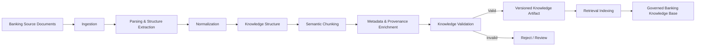
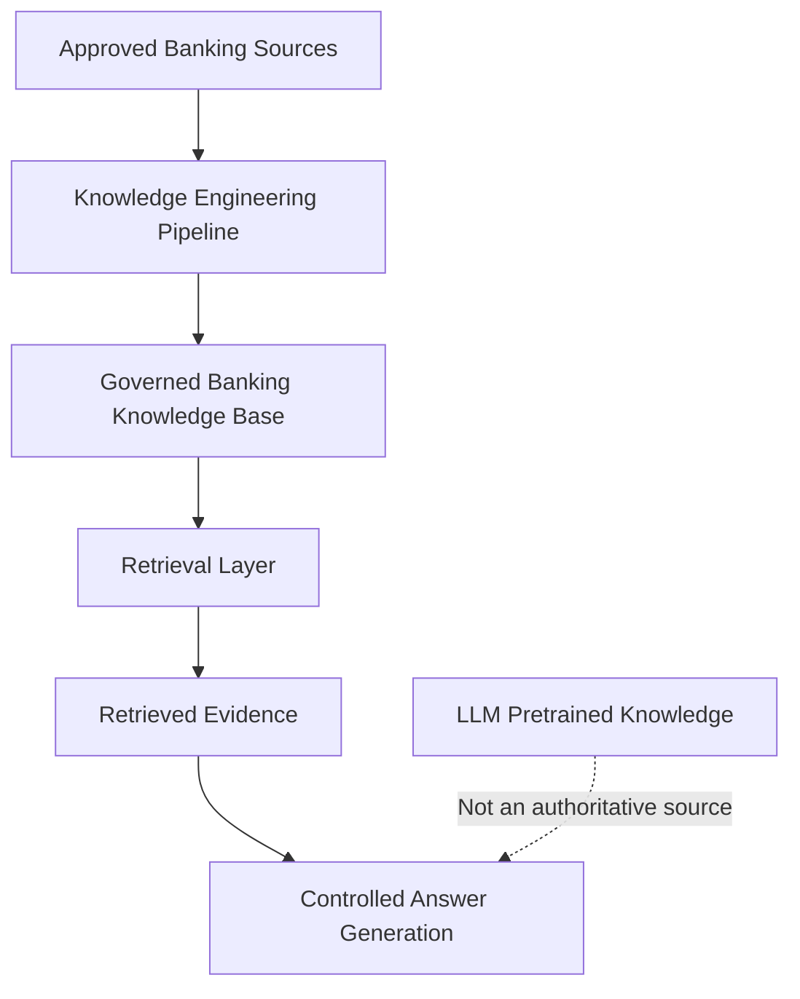
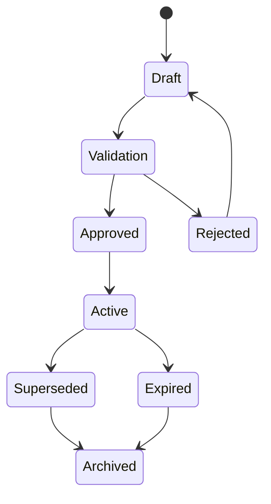
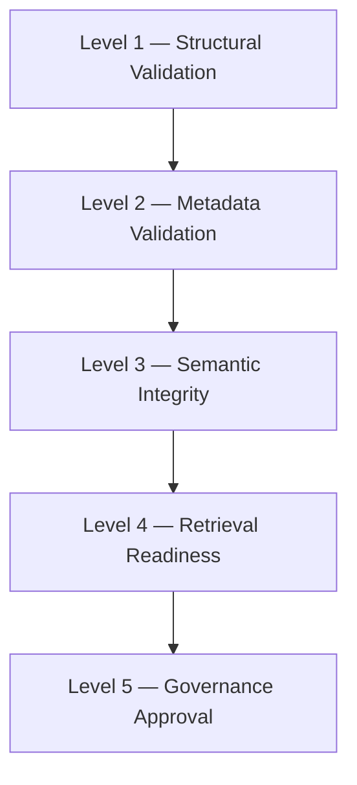
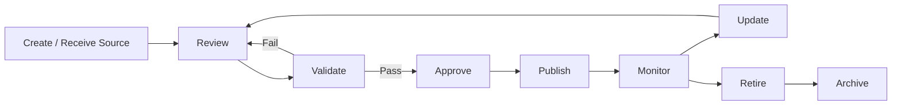
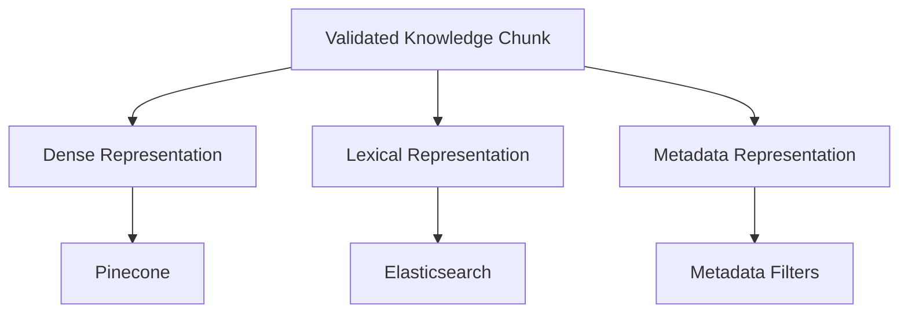
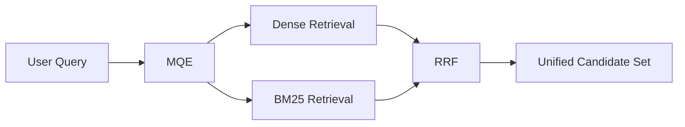
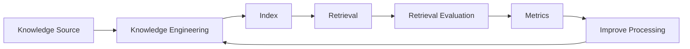
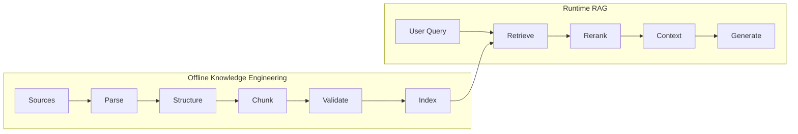
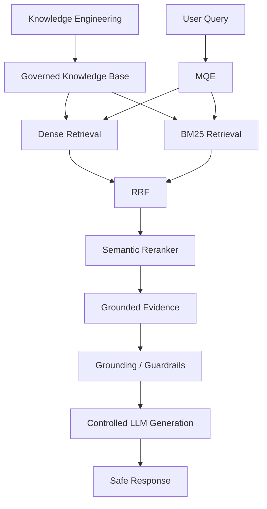

# Knowledge Engineering

**Project:** Advanced RAG — Banking Chat Agent  
**Document Type:** Knowledge Engineering Specification  
**Version:** 1.0  
**Status:** Baseline

## 1. Purpose

This document defines the knowledge engineering strategy for transforming governed banking source material into structured, validated, versioned, retrieval-ready knowledge.

The knowledge engineering layer is responsible for preserving banking meaning, structure, context, provenance, applicability, and governance metadata so that downstream retrieval can provide reliable evidence.

The governed banking knowledge base is the **authoritative source of banking information**. The LLM's pretrained knowledge is not an authoritative banking source.

## 2. Objectives

The knowledge engineering pipeline must provide:

1. Semantic preservation.
2. Structural preservation.
3. Context preservation.
4. Retrieval optimization.
5. Complete provenance and traceability.
6. Knowledge governance.
7. Temporal/version correctness.
8. Validation before indexing.
9. Reproducible knowledge builds.
10. Evidence suitable for safe answer generation.

## 3. Knowledge Lifecycle



## 4. Source of Truth



The LLM may interpret and generate from retrieved evidence, but must not independently introduce banking facts absent from the governed knowledge base.

## 5. Source Types

| Source Type | Examples | Engineering Consideration |
|---|---|---|
| Product documents | Account/product descriptions | Preserve product-specific conditions |
| Policy documents | Eligibility, restrictions, policies | Preserve rules and exceptions |
| Process documents | Application, claim, closure procedures | Preserve ordered steps |
| FAQ documents | Common customer questions | Useful for retrieval and answer formulation |
| Rate/fee documents | Charges, limits, rates | Strong temporal/version requirements |
| Scenario documents | Customer situations and decision guides | Preserve scenario coherence |
| Terms and conditions | Formal product conditions | Preserve clauses and applicability |
| Operational guides | Internal process/reference material | Apply governance/access controls |

Only approved and governed sources should enter the production knowledge pipeline.

## 6. Source Document Contract

Recommended document metadata:

```yaml
document_id: "..."
document_type: "product"
title: "..."
version: "..."
status: "active"
effective_from: "..."
effective_until: null
source_owner: "..."
source_system: "..."
jurisdiction: "..."
language: "en"
product: "..."
audience: "customer"
classification: "..."
created_at: "..."
updated_at: "..."
```

## 7. Document States



| State | Meaning |
|---|---|
| `draft` | Document is being prepared |
| `validation` | Document is undergoing validation |
| `approved` | Document passed governance approval |
| `active` | Document is currently applicable |
| `superseded` | Replaced by a newer version |
| `expired` | No longer applicable |
| `archived` | Retained for historical traceability |
| `rejected` | Failed validation or governance review |

Production retrieval should normally operate against approved and active knowledge, subject to temporal and applicability rules.

## 8. Parsing Strategy

### 8.1 Markdown

Markdown is treated as a structured source format.

The Phase 1A foundation uses a lightweight heading-based parser. The initial section splitter uses the conceptual pattern:

```text
^#{2,4}\s+
```

This identifies H2–H4 headings while preserving the Markdown content within each section.

Tables, lists, ordered steps, paragraphs, examples, and inline formatting should remain intact wherever possible.

### 8.2 YAML Front Matter

YAML front matter stores document-level metadata.

```yaml
---
document_id: BSBDA-001
document_type: product
title: Basic Savings Bank Deposit Account
version: "1.0"
status: active
effective_from: 2026-01-01
product: BSBDA
---
```

`PyYAML` may be used for front-matter parsing.

## 9. Knowledge Structure

```text
Knowledge Base
└── Document
    ├── Document Metadata
    ├── Section
    │   ├── Heading
    │   ├── Heading Hierarchy
    │   └── Content
    ├── Section
    └── ...
```

Runtime retrieval representation:

```text
Document
    ↓
Knowledge Sections
    ↓
Semantic Chunks
    ↓
Enriched Chunks
    ↓
Embeddings + Lexical Index
```

## 10. Knowledge Sections

A `KnowledgeSection` represents a semantically meaningful document section while preserving original Markdown content.

Conceptually:

```python
KnowledgeSection(
    heading="Eligibility",
    level=2,
    content="...",
    heading_path=[
        "Product Overview",
        "Eligibility"
    ]
)
```

Recommended fields:

```text
document_id
section_id
heading
heading_level
heading_path
content
source_location
```

## 11. Heading Hierarchy

Heading hierarchy is treated as semantic context.

Example:

```text
# BSBDA
## Eligibility
### Individual Eligibility
### Institutional Eligibility
## Charges
### Account Opening Charges
```

A chunk under `Individual Eligibility` should retain:

```text
BSBDA
→ Eligibility
→ Individual Eligibility
```

## 12. Context Breadcrumbs

Context breadcrumbs are prepended to generated chunk text to reduce orphaned retrieval units.

Example:

```text
# BSBDA
## Eligibility
### Individual Eligibility

[Original section content...]
```

Breadcrumbs should:

- Identify the document.
- Preserve relevant heading hierarchy.
- Precede original content.
- Not replace original content.
- Remain deterministic.

## 13. Semantic Chunking

Chunking occurs after document structure extraction.

Preferred boundaries are:

1. Document sections.
2. Subsections.
3. Complete procedures.
4. Complete rules.
5. Complete tables.
6. Complete examples.
7. Logical paragraph groups.

Avoid splitting:

- Conditions from consequences.
- Rules from exceptions.
- Procedure steps from prerequisites.
- Tables from explanatory context.
- Questions from their answers where they form one semantic unit.

Chunk size is a tunable retrieval parameter and should ultimately be benchmarked rather than assumed to be optimal.

## 14. Scenario and Decision Guide Documents

Scenario documents are highly interconnected:

```text
Scenario
├── Customer Situation
├── Conditions
├── Decision Criteria
├── Applicable Rule
├── Exceptions
└── Recommended Resolution
```

A complete Scenario document should therefore be treated as a **single semantic chunk when it fits within the configured size limit**.

If it exceeds the limit, semantic splitting may be used while preserving scenario identity, conditions, exceptions, and resolution context.

## 15. Tables

Tables should remain intact whenever possible.

The representation must preserve relationships between:

- Rows.
- Columns.
- Values.
- Table headings.
- Section context.

A table should not be split into fragments that make individual values ambiguous.

## 16. Lists and Procedures

Ordered procedures should preserve their order.

```text
1. Submit the application.
2. Provide identity documents.
3. Complete verification.
4. Receive confirmation.
```

If splitting is required, metadata and breadcrumbs must preserve procedure identity, step position, prerequisites, and expected outcome.

## 17. Metadata Enrichment

Recommended chunk metadata:

```yaml
chunk_id: "..."
document_id: "..."
document_version: "..."
document_type: "..."
document_title: "..."
section_id: "..."
heading_path:
  - "..."
  - "..."
chunk_index: 0
chunk_type: "section"
status: "active"
effective_from: "..."
effective_until: null
product: "..."
jurisdiction: "..."
audience: "customer"
source_location: "..."
content_hash: "..."
```

Metadata supports filtering, provenance, version selection, temporal filtering, citation, evaluation, debugging, and re-indexing.

## 18. Provenance

Every chunk must be traceable:

```text
Answer
  ↓
Retrieved Chunk
  ↓
Chunk ID
  ↓
Document Version
  ↓
Source Document
  ↓
Source Location
```

## 19. Versioning

Knowledge is versioned independently from application code.

```text
Document
├── v1.0
├── v1.1
├── v2.0
└── ...
```

Each version should contain a version identifier, effective date, expiration/supersession information, content hash, processing configuration, validation status, and source provenance.

A newer version must not silently overwrite historical knowledge.

## 20. Effective Dates

Time-sensitive knowledge may include fees, rates, limits, eligibility rules, and product availability.

The retrieval layer should be able to apply temporal constraints:

```text
User Query
    ↓
Current Date / Applicability
    ↓
Retrieve applicable knowledge
    ↓
Rerank
```

Historical knowledge may remain available for auditing and historical questions but must not automatically be treated as current.

## 21. Knowledge Validation

Validation should cover:

### Structural validity
- Required metadata exists.
- Document structure is valid.
- Headings are consistent.
- Markdown is parseable.
- Tables are not corrupted.

### Semantic integrity
- Sections retain their meaning.
- Procedures are complete.
- Rules and exceptions remain connected.
- Scenario context is preserved.

### Governance validity
- Source is approved.
- Owner exists.
- Version exists.
- Effective dates are valid.
- Status is valid.

### Retrieval readiness
- Chunks meet configured constraints.
- Metadata is complete.
- Chunk IDs are unique.
- Content hashes exist.

## 22. Knowledge Validation Pyramid



## 23. Content Hashing

A deterministic content hash should be generated for knowledge artifacts.

```text
Normalized Source
      +
Processing Configuration
      ↓
Content Hash
```

Hashes support change detection, duplicate detection, reproducibility, version comparison, and incremental indexing.

## 24. Deduplication

Duplicate and near-duplicate knowledge should be identified before indexing.

Potential duplication sources include repeated documents, multiple copies of policies, unchanged versions, duplicate sections, and repeated FAQs.

Legitimate historical versions must not be removed merely because their text is similar.

## 25. Contradiction Detection

Potential contradictions should be identified before production indexing.

Example:

```text
Document A:
Fee = ₹100

Document B:
Fee = ₹150
```

The system should not silently resolve this. Governance must determine whether one version supersedes another or whether applicability differs.

## 26. Knowledge Governance Lifecycle



## 27. Retrieval Representation



## 28. Dense Retrieval

The embedding model is a benchmarked architecture decision rather than a permanently fixed choice.

Benchmark criteria should include:

- Retrieval recall.
- Domain relevance.
- Multilingual performance where applicable.
- Latency.
- Cost.
- Vector dimensionality.
- Index size.
- Performance on banking evaluation queries.

## 29. Lexical Retrieval

Elasticsearch is the lexical index. It scores with native BM25 (`k1 = 1.5`, `b = 0.75`) over `chunk.text`. The index is persistent. Kibana is the local inspection interface.

It is particularly useful for:

- Product names.
- Policy terminology.
- Exact phrases.
- Account types.
- Codes.
- Named entities.
- Numbers and limits.

Dense and lexical retrieval are complementary.

## 30. Multi-Query Expansion

The retrieval architecture uses **Multi-Query Expansion (MQE)**.

```text
Original User Query
        │
        ▼
   Query Understanding
        │
        ▼
      MQE
   /    |     Q1    Q2    Q3
  │     │     │
  ▼     ▼     ▼
Dense / Lexical Retrieval
```

Expanded queries should preserve the user's intent and avoid unrelated assumptions.

## 31. Reciprocal Rank Fusion

Results from multiple retrieval paths are combined using **Reciprocal Rank Fusion (RRF)**.



## 32. Semantic Reranking

```text
MQE
 ↓
Dense Retrieval ─┐
                  ├──> RRF ──> Candidate Set ──> Reranker
BM25 Retrieval ───┘
                                      │
                                      ▼
                              Ranked Evidence
```

The semantic reranker prioritizes evidence most relevant to the actual query.

## 33. Context Assembly

Final context should consider:

- Relevance score.
- Source priority.
- Document version.
- Effective date.
- Heading context.
- Duplicate evidence.
- Chunk relationships.
- Token budget.
- Coverage of the user's question.

The context should be evidence-oriented and minimize irrelevant material.

## 34. Knowledge and Guardrails

The knowledge layer directly supports the guardrail policy:

1. Strictly answer only what exists in the banking knowledge base.
2. If only part of a query is supported, return the supported portion and reject or qualify the unsupported portion.
3. If required information is ambiguous or missing, provide available information and ask for clarification where appropriate.

Knowledge engineering must preserve sufficient evidence for these decisions.

## 35. Claim-Level Support

```text
User Query
    ↓
Claims
    ├── Claim A
    ├── Claim B
    └── Claim C
          ↓
Retrieved Evidence
          ↓
Claim Support
    ├── Supported
    ├── Partially Supported
    └── Unsupported
```

This supports partial-answer behavior and claim-level evaluation.

## 36. Knowledge Quality Metrics

| Metric | Purpose |
|---|---|
| Parse success rate | Measures ingestion reliability |
| Metadata completeness | Measures governance readiness |
| Chunk validity rate | Measures structural quality |
| Duplicate rate | Detects redundant knowledge |
| Contradiction rate | Detects conflicting knowledge |
| Provenance completeness | Measures traceability |
| Retrieval recall | Measures whether relevant evidence is retrievable |
| Retrieval precision | Measures relevance of retrieved evidence |
| Context coverage | Measures whether evidence covers the query |
| Temporal correctness | Measures correct version applicability |

## 37. Retrieval Evaluation Dataset

A curated dataset should contain:

```text
Query
Expected Document(s)
Expected Section(s)
Expected Chunk(s)
Relevant Metadata
Support Type
```

Support types:

```text
FULL
PARTIAL
NONE
```

This dataset becomes the foundation for evaluating MQE, dense retrieval, BM25, RRF, reranking, and context assembly.

## 38. Knowledge Engineering Evaluation Loop



## 39. Reproducibility

A knowledge build should record:

```yaml
knowledge_build_id: "..."
source_snapshot: "..."
parser_version: "..."
chunker_version: "..."
normalization_version: "..."
metadata_schema_version: "..."
embedding_model: "..."
embedding_version: "..."
created_at: "..."
```

## 40. Separation of Concerns

Knowledge engineering remains separate from runtime RAG orchestration.



## 41. Failure Handling

| Failure | Expected Behavior |
|---|---|
| Invalid front matter | Reject document |
| Missing required metadata | Reject or send for review |
| Invalid Markdown structure | Reject or quarantine |
| Oversized semantic unit | Apply specialized chunking |
| Duplicate document | Flag for deduplication |
| Conflicting active versions | Block publication until resolved |
| Missing provenance | Block publication |
| Failed validation | Do not index |
| Indexing failure | Preserve validated artifact and retry indexing |

Knowledge failures must never silently produce partially trusted production knowledge.

## 42. Security and Governance

Knowledge engineering must preserve document classification and access metadata.

Potential controls include:

```text
classification
audience
role
product
jurisdiction
tenant
access_scope
```

Authorization remains a runtime concern, but knowledge engineering must preserve metadata required to enforce it.

## 43. Implementation Phases

### Phase 1A — Document Foundation

- Front matter parsing.
- Markdown parsing.
- `KnowledgeDocument`.
- `KnowledgeSection`.
- Document metadata.
- Heading hierarchy.
- Source preservation.
- Basic validation.

### Phase 1B — Chunking Foundation

- Semantic chunking.
- Context breadcrumbs.
- Chunk identifiers.
- Chunk metadata.
- Scenario handling.
- Table handling.
- Procedure handling.
- Chunk-size policies.

### Phase 1C — Governance and Validation

- Document status.
- Versioning.
- Effective dates.
- Provenance.
- Content hashing.
- Validation pipeline.
- Duplicate detection.
- Contradiction detection.
- Build manifests.

### Phase 1D — Retrieval Index Preparation

- Embedding generation.
- Pinecone indexing.
- Elasticsearch BM25 indexing.
- Metadata filters.
- Index manifests.
- Re-indexing strategy.

### Phase 1E — Retrieval Evaluation

- Curated retrieval dataset.
- Dense retrieval evaluation.
- BM25 evaluation.
- MQE evaluation.
- RRF evaluation.
- Reranker evaluation.
- End-to-end retrieval evaluation.

## 44. Architectural Invariants

1. The governed knowledge base is the authoritative banking source.
2. The LLM's pretrained knowledge is not an authoritative banking source.
3. Every production chunk must have provenance.
4. Knowledge versions must be explicit.
5. Effective dates must be preserved where applicable.
6. Semantic boundaries should be preferred over arbitrary chunk boundaries.
7. Context breadcrumbs must preserve document hierarchy.
8. Scenario documents should remain cohesive when their size permits.
9. Tables should remain structurally meaningful.
10. Procedures should preserve ordering.
11. Invalid knowledge must not enter production retrieval.
12. Runtime retrieval must distinguish applicable knowledge from historical or superseded knowledge.
13. Retrieval quality must be measured using curated evaluation data.
14. Knowledge processing must be reproducible.
15. Knowledge engineering and runtime RAG orchestration remain separate concerns.

## 45. Definition of Done

The knowledge engineering foundation is complete when:

- [ ] Approved source documents can be ingested.
- [ ] Front matter is parsed reliably.
- [ ] Markdown structure is preserved.
- [ ] Heading hierarchy is represented.
- [ ] `KnowledgeDocument` and `KnowledgeSection` are implemented.
- [ ] Semantic chunks are generated deterministically.
- [ ] Context breadcrumbs are included.
- [ ] Tables and procedures retain semantic integrity.
- [ ] Scenario documents follow the cohesion policy.
- [ ] Chunk metadata is complete.
- [ ] Provenance is available for every chunk.
- [ ] Version and effective-date metadata are supported.
- [ ] Content hashes are generated.
- [ ] Validation blocks invalid knowledge.
- [ ] Knowledge builds are reproducible.
- [ ] Retrieval indexes can be generated from validated artifacts.
- [ ] Retrieval evaluation data exists.
- [ ] Retrieval performance is measurable.
- [ ] The knowledge base can be audited from retrieved chunk back to source.

## 46. Relationship to Runtime RAG



> **Knowledge engineering determines what the system knows. Runtime RAG determines which governed knowledge is relevant to a user's query. The answer-generation layer determines how that evidence is communicated without introducing unsupported banking information.**
