# RAG Design

**Project:** Advanced RAG — Banking Chat Agent  
**Document Type:** Retrieval-Augmented Generation Design Specification  
**Version:** 1.0  
**Status:** Baseline

## 1. Purpose

This document defines the runtime Retrieval-Augmented Generation (RAG) architecture for the banking chat agent.

The RAG system is responsible for finding relevant evidence from the governed banking knowledge base and providing that evidence to the downstream answer-generation and guardrail layers.

> **The governed banking knowledge base is the authoritative source for banking information.**

The LLM must not use its pretrained knowledge as an authoritative banking source.

## 2. RAG Objectives

The RAG system must:

1. Retrieve relevant banking knowledge with high recall.
2. Combine semantic and lexical retrieval.
3. Handle different phrasings of the same user intent.
4. Reduce duplicate retrieval results.
5. Rerank candidates according to semantic relevance.
6. Preserve document and chunk provenance.
7. Respect knowledge version and applicability metadata.
8. Provide evidence suitable for grounded generation.
9. Support partial-answer and clarification behavior.
10. Be measurable through offline and runtime evaluation.
11. Remain observable through tracing.
12. Fail safely when sufficient evidence cannot be retrieved.

## 3. Scope

### In Scope

- Query preprocessing and understanding.
- Multi-Query Expansion (MQE).
- Dense retrieval.
- Lexical retrieval using BM25.
- Reciprocal Rank Fusion (RRF).
- Semantic reranking.
- Metadata and temporal filtering.
- Context assembly.
- Evidence validation.
- Grounded answer generation support.
- Retrieval tracing and evaluation.

### Out of Scope

- Banking transactions.
- Money movement.
- Account modification.
- External actions.
- Autonomous financial decisions.
- Knowledge authoring and approval workflows.

The agent is a **question-answering system**, not a transactional banking agent.

## 4. High-Level Architecture

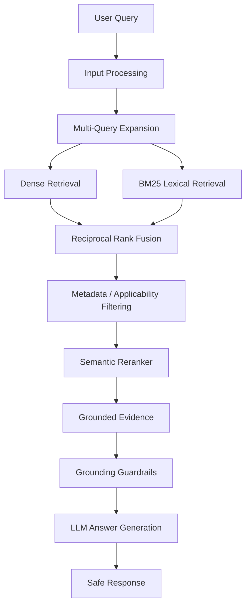

## 5. Retrieval Pipeline

```text
User Query
    ↓
Input Processing
    ↓
Query Understanding
    ↓
Multi-Query Expansion
    ↓
Dense + BM25 Retrieval
    ↓
RRF
    ↓
Metadata / Applicability Filtering
    ↓
Semantic Reranking
    ↓
Evidence Selection
    ↓
Context Assembly
    ↓
Grounding Validation
    ↓
LLM Generation
```

## 6. Input Processing

The first stage receives the user's natural-language question.

Deterministic processing may include:

- Whitespace normalization.
- Request ID association.
- Basic malformed-input checks.
- Input guardrail checks.
- Prompt-injection checks.

The original user query must remain available for downstream processing.

## 7. Query Understanding

The system may identify:

```text
Intent
Product
Topic
Time sensitivity
Entities
Constraints
Question type
```

Query understanding must not invent missing requirements.

## 8. Multi-Query Expansion

The system uses **Multi-Query Expansion (MQE)** to improve retrieval recall.

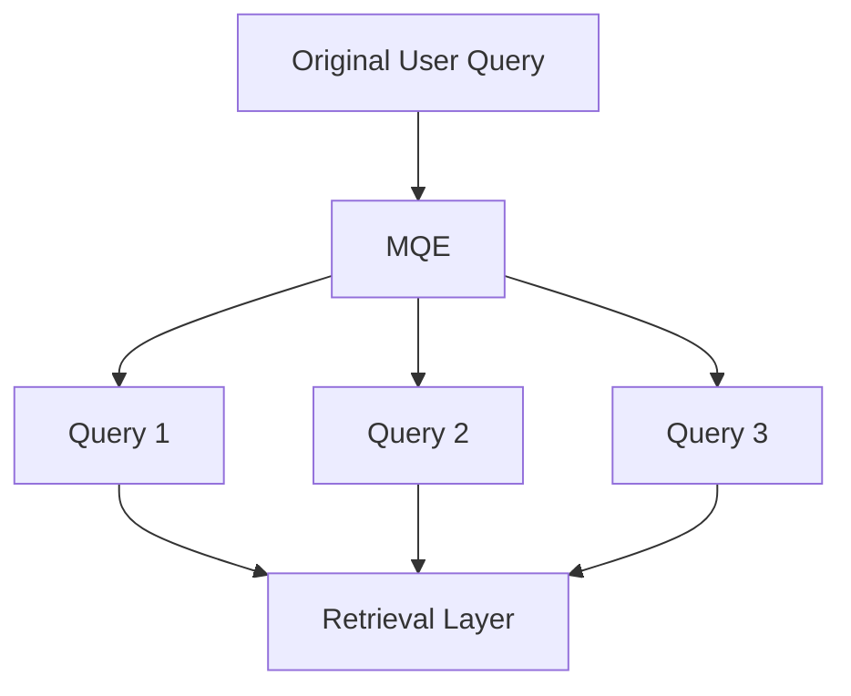

MQE generates alternative formulations that preserve the original intent.

Example:

```text
Original:
"What are the charges for opening a BSBDA account?"

Expanded:
1. BSBDA account opening charges
2. BSBDA fees for opening an account
3. charges applicable when opening a Basic Savings Bank Deposit Account
```

MQE must preserve important entities, numbers, temporal constraints, and product identity.

## 9. Dense Retrieval

Dense retrieval uses vector embeddings to identify semantically similar knowledge chunks.

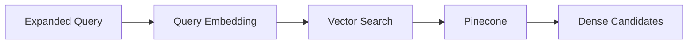

**Pinecone** is the selected vector database.

Each indexed knowledge chunk should retain:

```text
Embedding
Chunk ID
Document ID
Document Version
Metadata
Provenance
```

## 10. Embedding Model

The embedding model remains a **benchmark-and-select decision**.

The final model should be selected using the retrieval evaluation dataset.

Evaluation dimensions include:

| Dimension | Purpose |
|---|---|
| Retrieval Recall | Relevant chunks retrieved |
| Retrieval Precision | Retrieved chunks are relevant |
| Domain Performance | Banking terminology performance |
| Latency | Query-time performance |
| Cost | Embedding cost |
| Vector Size | Storage/index efficiency |
| Multilingual Capability | Performance where applicable |

Embedding generation must be hidden behind an abstraction so the model can be replaced without redesigning the retrieval architecture.

## 11. BM25 Lexical Retrieval

BM25 provides lexical retrieval.

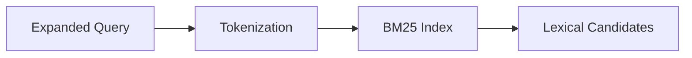

BM25 is particularly useful for:

- Product names.
- Banking terminology.
- Account types.
- Policy phrases.
- Codes.
- Named entities.
- Numbers.
- Fees and limits.

Dense retrieval and BM25 are complementary.

## 12. Hybrid Retrieval

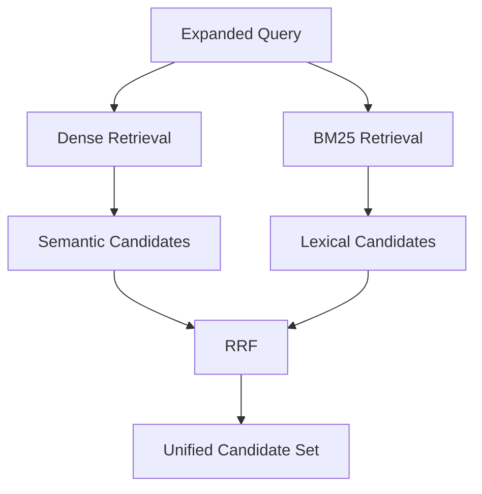

The purpose is to combine semantic similarity with lexical precision.

## 13. Reciprocal Rank Fusion

**Reciprocal Rank Fusion (RRF)** combines independently ranked candidate lists.

```text
Dense Results ─────┐
                   ├──> RRF ──> Unified Candidates
BM25 Results ──────┘
```

RRF should:

1. Deduplicate chunks.
2. Combine rankings.
3. Produce a unified candidate set.
4. Preserve retrieval-source metadata.
5. Preserve original ranking information.

## 14. Candidate Metadata

Each candidate should retain information such as:

```yaml
chunk_id: "..."
document_id: "..."
document_version: "..."
retrieval_sources:
  - dense
  - bm25
dense_rank: 4
bm25_rank: 2
rrf_score: 0.0317
effective_from: "..."
effective_until: null
status: active
```

This metadata supports debugging, evaluation, observability, and auditability.

## 15. Metadata and Applicability Filtering

Candidates may be filtered using:

```text
status
effective_from
effective_until
product
jurisdiction
audience
document_type
classification
access_scope
```

Historical or superseded documents must not automatically be treated as current knowledge.

## 16. Temporal Retrieval

Banking information can change over time, including fees, rates, limits, eligibility rules, and procedures.

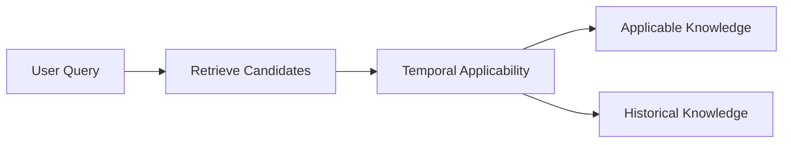

The runtime should determine which path is appropriate based on the question and available metadata.

## 17. Semantic Reranking

The RRF candidate set is passed to a semantic reranker.

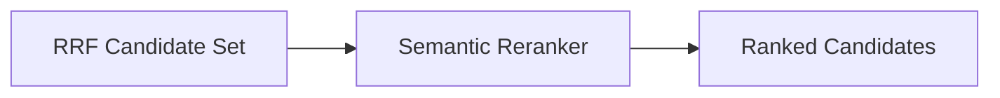

The reranker evaluates:

```text
Original User Query
        +
Candidate Knowledge Chunk
```

The reranker should prioritize:

1. Direct relevance.
2. Semantic alignment.
3. Question coverage.
4. Product alignment.
5. Applicability.
6. Context completeness.

The reranker does not generate the final answer.

## 18. Candidate Selection

```text
Reranked Candidates
        ↓
Evidence Threshold
        ↓
Top-K / Coverage Selection
        ↓
Evidence Set
```

Candidate selection should avoid unnecessary evidence because excessive context can increase latency, token usage, and irrelevant information.

## 19. Context Assembly

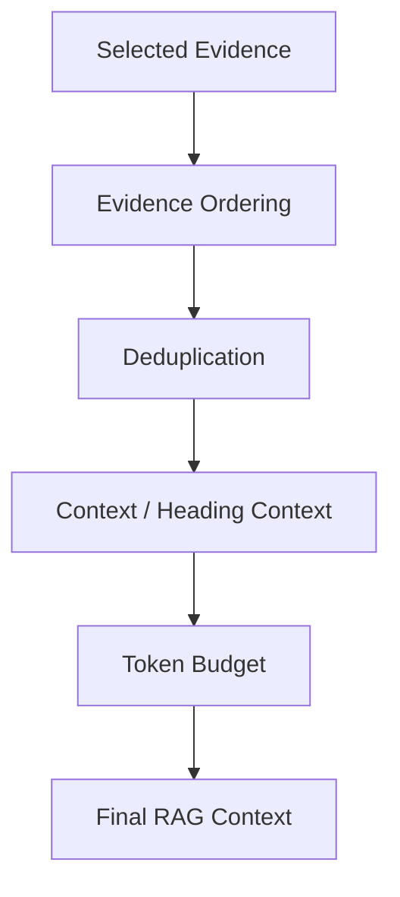

Context should preserve document title, heading hierarchy, relevant content, version information where required, and provenance.

## 20. Evidence Grounding

Before generation, the system determines whether retrieved evidence supports the requested answer.

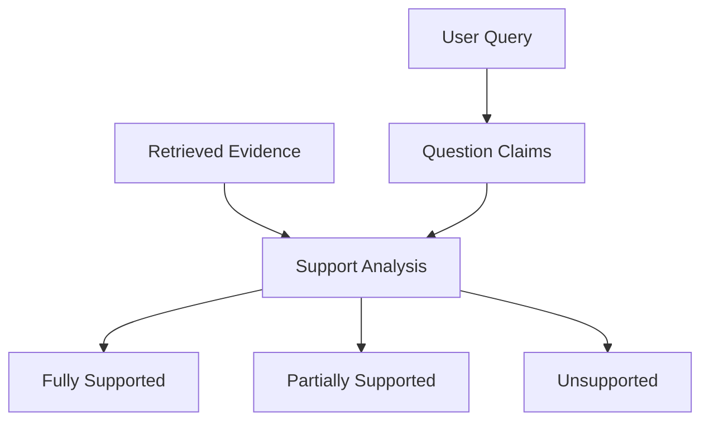

## 21. Support Policy

### Fully Supported

Provide the answer using retrieved evidence.

### Partially Supported

Return the supported portion and explicitly avoid presenting unsupported information as fact.

### Insufficient / Ambiguous

Provide available information and ask for clarification where required.

The system must not fill unsupported gaps using the LLM's pretrained knowledge.

## 22. Claim-Level Grounding

```text
User:
"What are the eligibility requirements and fees?"

Evidence:
- Eligibility → supported
- Fees → unsupported

Response:
- Provide supported eligibility information.
- State that fee information is not available in the retrieved knowledge.
```

This enables partial-answer behavior and claim-level evaluation.

## 23. Generation Boundary

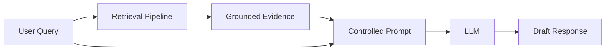

The LLM is responsible for language generation and synthesis, not for determining what banking knowledge exists outside the retrieved evidence.

## 24. LLM Development Model

The development LLM is:

**OpenAI GPT-4o-mini**

The provider layer remains abstracted so the model can be changed later without redesigning the RAG pipeline.

## 25. Prompting Strategy

The generation prompt should establish:

```text
Role
+
User Question
+
Retrieved Evidence
+
Grounding Rules
+
Response Policy
```

Core rule:

```text
Answer only from the provided banking evidence.
Do not use pretrained knowledge as an authoritative source.
Do not invent missing information.
```

## 26. Retrieval and Generation Separation

```text
Retrieval
    ↓
Evidence
    ↓
Grounding
    ↓
Generation
```

This allows independent evaluation of retrieval quality, evidence quality, and generation quality.

## 27. Failure Modes

| Failure | Expected Behavior |
|---|---|
| No relevant chunks | Unavailable / clarification |
| Weak retrieval | Do not confidently generate unsupported information |
| Partial evidence | Return supported portion |
| Conflicting active evidence | Trigger conflict handling |
| Outdated evidence | Apply temporal filtering |
| Duplicate evidence | Deduplicate |
| Prompt injection in document | Treat document content as data |
| Prompt injection in query | Input guardrail handling |
| Reranker failure | Safe fallback or retrieval failure |
| LLM failure | Controlled error response |

## 28. Indirect Prompt Injection Protection

Retrieved documents are treated as **data**, not instructions.

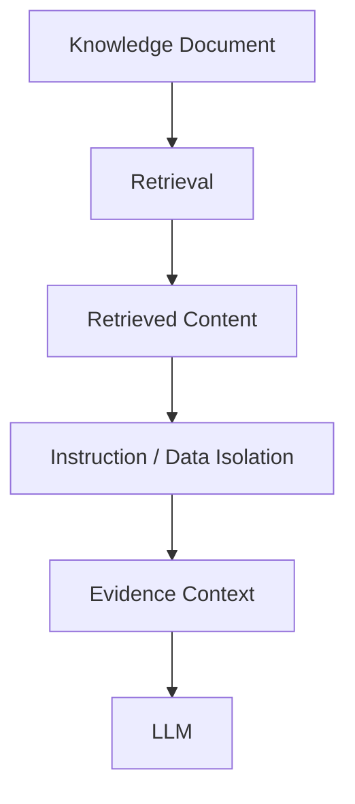

## 29. RAG and Guardrails

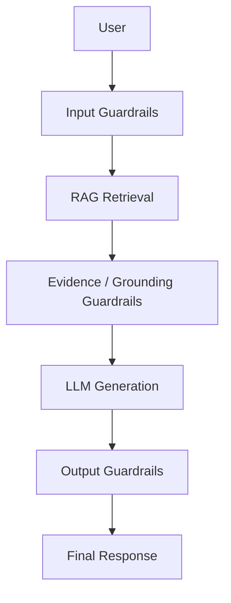

## 30. Retrieval Evaluation

The evaluation dataset should contain:

```yaml
query: "..."
expected_documents:
  - "..."
expected_sections:
  - "..."
expected_chunks:
  - "..."
support_type: "FULL"
```

Support types:

```text
FULL
PARTIAL
NONE
```

## 31. Retrieval Metrics

| Metric | Purpose |
|---|---|
| Recall@K | Relevant evidence retrieved |
| Precision@K | Retrieved evidence relevance |
| MRR | Position of first relevant result |
| nDCG@K | Ranking quality |
| Hit Rate@K | Whether relevant evidence appears |
| Context Recall | Whether required evidence is included |
| Context Precision | Whether context is relevant |
| Latency | Retrieval performance |

## 32. Pipeline-Level Evaluation

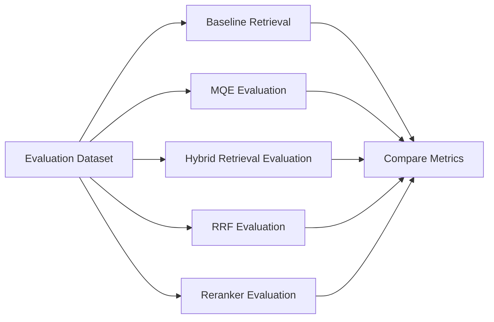

Each additional component should be evaluated for measurable improvement.

## 33. RAGAS Integration

Ragas will be used alongside custom evaluators.

Potential dimensions include:

- Faithfulness.
- Context relevance.
- Context recall.
- Answer relevance.

Ragas should not be treated as the only evaluation mechanism.

## 34. Custom Banking Evaluators

Custom evaluators should cover:

1. KB-only compliance.
2. Claim-level support.
3. Unsupported claim detection.
4. Partial-answer correctness.
5. Clarification correctness.
6. Temporal correctness.
7. Citation/provenance correctness.
8. Banking terminology correctness.

## 35. Judge Model

The project will use **JEV / System One** as a judge/evaluator component.

Judge outputs are evaluation signals, not unquestionable truth.

The judge must be validated against curated human-reviewed evaluation examples.

## 36. Tracing

**LangSmith** is the selected tracing and evaluation platform.

A trace should make it possible to inspect:

```text
Request
 ↓
Input Guardrails
 ↓
Query Understanding
 ↓
MQE
 ↓
Dense Retrieval
 ↓
BM25
 ↓
RRF
 ↓
Metadata Filtering
 ↓
Reranking
 ↓
Context Assembly
 ↓
Grounding
 ↓
LLM
 ↓
Output Guardrails
 ↓
Response
```

## 37. RAG Observability

Important runtime fields include:

```text
request_id
conversation_id
query
expanded_queries
retrieval_latency
dense_results
bm25_results
rrf_candidates
reranker_scores
selected_chunks
document_versions
grounding_decision
model
token_usage
total_latency
final_response
```

Sensitive customer data must be handled according to project privacy and logging requirements.

## 38. Latency Budget

```text
Total Latency
=
Input Processing
+
MQE
+
Dense Retrieval
+
BM25
+
RRF
+
Filtering
+
Reranking
+
Context Assembly
+
Grounding
+
LLM Generation
+
Output Guardrails
```

Optimization should target measured bottlenecks.

## 39. Caching

Potential caching layers may include:

```text
Query Understanding Cache
MQE Cache
Embedding Cache
Retrieval Cache
```

Caching must account for knowledge versions and applicability. Cached results must not cause stale banking information to be returned.

## 40. Conversation Context

Conversation memory is useful for understanding follow-up questions.

Example:

```text
User:
"What is BSBDA?"

Assistant:
"..."

User:
"What are its charges?"
```

Conversation memory may resolve `its`, but:

> **Conversation memory is context, not the source of truth.**

Banking facts must still be grounded in the governed knowledge base.

## 41. Follow-Up Query Resolution

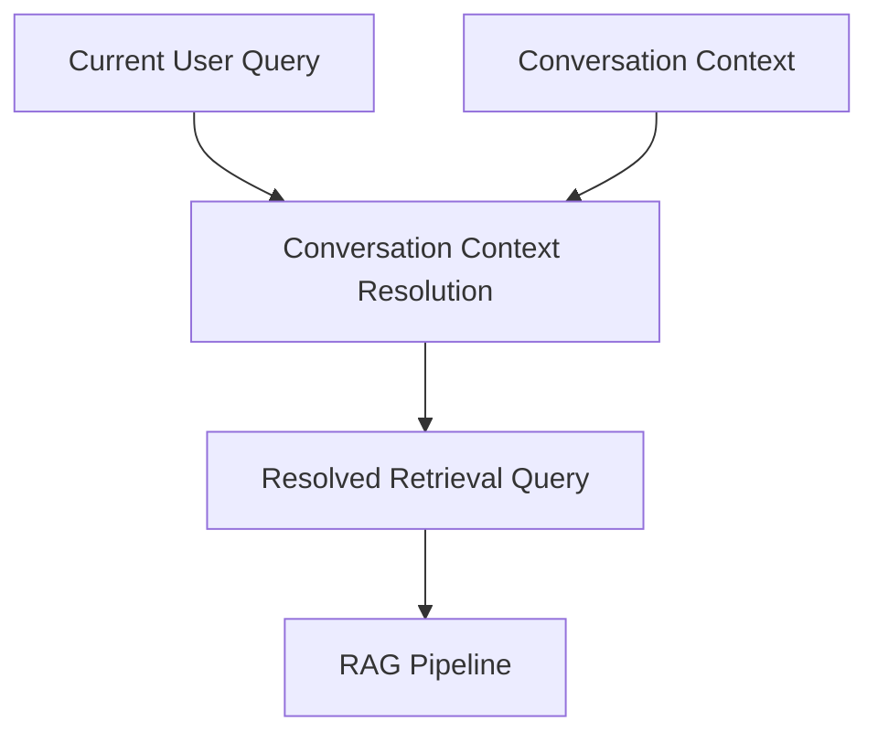

The resolved query must not introduce unsupported facts.

## 42. Security Boundaries

The RAG pipeline should maintain clear boundaries between:

```text
User Input
Knowledge Content
System Instructions
Tool / Infrastructure Metadata
```

Retrieved content must not override system-level instructions.

## 43. End-to-End Data Flow

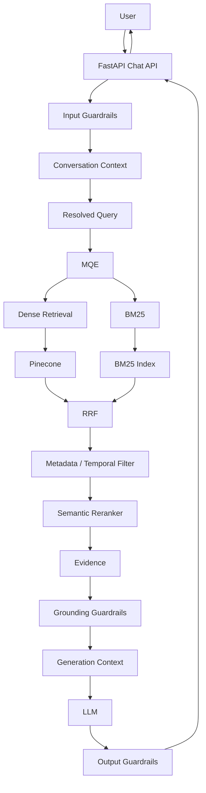

## 44. Component Responsibilities

| Component | Responsibility |
|---|---|
| Query Processor | Normalize and prepare query |
| Query Understanding | Identify retrieval intent and constraints |
| MQE | Generate useful query variants |
| Embedding Provider | Generate query embeddings |
| Pinecone | Dense vector retrieval |
| BM25 | Lexical retrieval |
| RRF | Fuse retrieval rankings |
| Metadata Filter | Enforce applicability constraints |
| Semantic Reranker | Re-rank candidates |
| Context Builder | Construct grounded context |
| Grounding Layer | Determine evidence support |
| LLM Provider | Generate natural-language response |
| Guardrails | Enforce safety and grounding policies |
| LangSmith | Trace and evaluate pipeline execution |

## 45. Suggested Code Organization

```text
app/
├── ai/
│   ├── embeddings/
│   ├── providers/
│   ├── prompts/
│   ├── rag/
│   │   ├── query.py
│   │   ├── mqe.py
│   │   ├── dense.py
│   │   ├── lexical.py
│   │   ├── fusion.py
│   │   ├── reranker.py
│   │   ├── filters.py
│   │   ├── context.py
│   │   ├── grounding.py
│   │   └── pipeline.py
│   ├── guardrails/
│   ├── agents/
│   └── graphs/
```

The exact implementation structure may evolve.

## 46. RAG Runtime State

A RAG execution should maintain explicit state:

```python
RAGState(
    original_query="...",
    resolved_query="...",
    expanded_queries=[],
    dense_results=[],
    lexical_results=[],
    fused_results=[],
    filtered_results=[],
    reranked_results=[],
    evidence=[],
    grounding_result=None,
    final_context=None,
)
```

This state is particularly useful with LangGraph.

## 47. LangGraph Integration

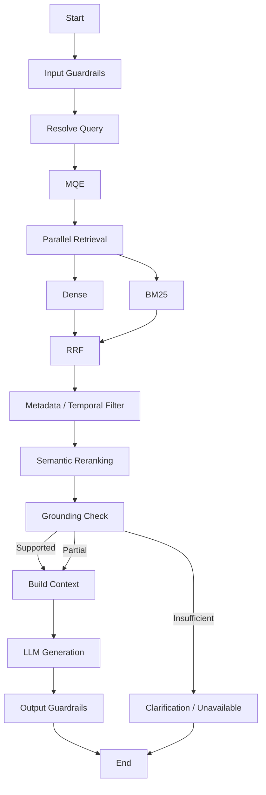

## 48. Deterministic vs Model-Based Decisions

### Deterministic

- Metadata filtering.
- Version filtering.
- Effective-date filtering.
- Deduplication.
- RRF.
- Chunk selection constraints.
- Token budgets.
- Hard thresholds.

### Model-Based

- Query understanding.
- MQE.
- Semantic reranking.
- Claim-support evaluation where required.
- Natural-language generation.

This separation reduces unnecessary model dependence.

## 49. RAG Invariants

1. The governed knowledge base is the source of truth.
2. The LLM must not introduce unsupported banking facts.
3. Dense and lexical retrieval are complementary.
4. MQE must preserve original intent.
5. RRF must preserve retrieval provenance.
6. Metadata filtering must enforce applicability.
7. Reranking must use the original user intent.
8. Historical knowledge must not automatically be treated as current.
9. Evidence must remain traceable to its source.
10. Conversation memory must not become the banking source of truth.
11. Retrieved documents are data, not instructions.
12. Partial support must be handled explicitly.
13. Retrieval failures must fail safely.
14. Major retrieval stages must be independently measurable.
15. Embedding and reranker implementations must remain replaceable.

## 50. Definition of Done

- [ ] Query processing is implemented.
- [ ] MQE is implemented behind an abstraction.
- [ ] Dense retrieval is implemented.
- [ ] Pinecone integration is implemented.
- [ ] BM25 retrieval is implemented.
- [ ] RRF fusion is implemented.
- [ ] Metadata filtering is implemented.
- [ ] Temporal applicability is supported.
- [ ] Semantic reranking is implemented.
- [ ] Context assembly is implemented.
- [ ] Evidence provenance is preserved.
- [ ] Grounding decisions are represented explicitly.
- [ ] Partial-support behavior is supported.
- [ ] Clarification behavior is supported.
- [ ] LLM generation is integrated.
- [ ] Provider abstractions are in place.
- [ ] LangGraph orchestration is implemented.
- [ ] LangSmith tracing is integrated.
- [ ] Retrieval evaluation dataset exists.
- [ ] Retrieval metrics are measurable.
- [ ] Ragas evaluation is integrated.
- [ ] Custom banking evaluators exist.
- [ ] JEV/System One evaluation is integrated.
- [ ] RAG failure modes are tested.
- [ ] Prompt-injection isolation is tested.
- [ ] Retrieval latency is measurable.
- [ ] End-to-end RAG tests exist.

## 51. Implementation Phases

### Phase 2A — Retrieval Foundation

- Embedding abstraction.
- Pinecone integration.
- BM25 integration.
- Retrieval interfaces.
- Metadata filtering.

### Phase 2B — Hybrid Retrieval

- MQE.
- Dense retrieval.
- BM25 retrieval.
- RRF.
- Candidate deduplication.

### Phase 2C — Reranking and Context

- Semantic reranker.
- Candidate selection.
- Context assembly.
- Provenance propagation.
- Temporal filtering.

### Phase 2D — Grounded Generation

- Grounding evaluation.
- LLM provider(using GPT-4o-mini).
- Prompt architecture.
- Partial-support behavior.
- Clarification behavior.

### Phase 2E — Agent Workflow

- LangGraph state.
- Retrieval nodes.
- Guardrail nodes.
- Generation node.
- Conditional routing.
- Failure handling.

### Phase 2F — Evaluation and Observability

- LangSmith tracing.
- Ragas evaluation.
- Custom evaluators.
- JEV/System One.
- Retrieval benchmark suite.
- Latency evaluation.
- Regression evaluation.

## 52. Final Architecture

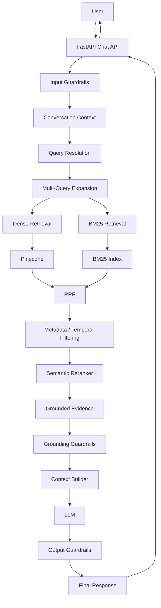

## 53. Architectural Summary

The banking RAG system follows:

```text
UNDERSTAND
    ↓
EXPAND
    ↓
RETRIEVE
    ↓
FUSE
    ↓
FILTER
    ↓
RERANK
    ↓
GROUND
    ↓
GENERATE
    ↓
VALIDATE
    ↓
RESPOND
```

The architecture deliberately separates **finding evidence** from **generating language**.

The retrieval layer determines which governed banking knowledge is relevant. The grounding and guardrail layers determine whether that evidence is sufficient for the requested response. The LLM then communicates the supported information in natural language.

This allows retrieval quality, grounding quality, generation quality, and safety behavior to be evaluated independently while maintaining a single authoritative knowledge source.
