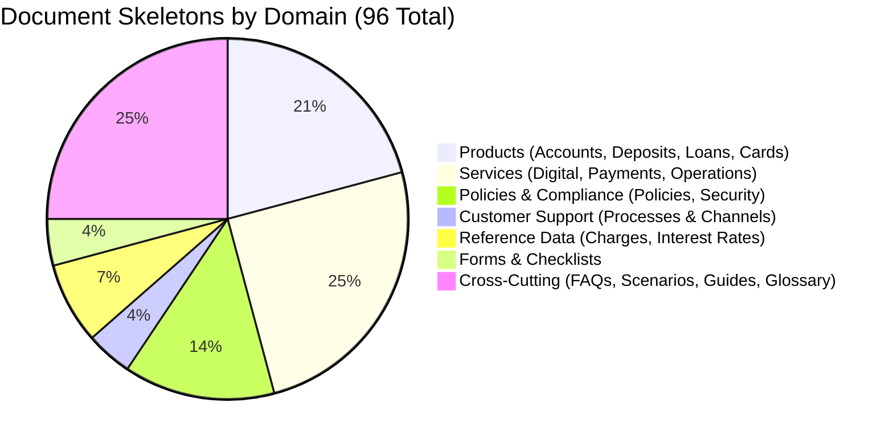

# Phase 4 — Knowledge Base Validation & AI Readiness Audit

**Audit Date**: 2026-08-03  
**Auditor**: Advanced Agentic RAG Architecture Team  
**Scope**: Complete documentation repository (`knowledge-base/`), including 96 document skeletons, metadata schemas, taxonomy, templates, and governance policies.  
**Objective**: Establish an immutable quality and architectural baseline before large-scale content generation (Phases 4–5) and AI RAG pipeline ingestion.

---

## Executive Summary

This audit evaluates the Banking Customer Support Knowledge Base across three pillars: **Documentation Quality**, **Knowledge Architecture**, and **Future AI Compatibility**. 

The repository consists of **158 total files**, including **96 standardized document skeletons** across **17 categories** and **7 domains**. Automated and architectural diagnostics confirm that the foundation is structurally sound, displaying **0 broken internal markdown hyperlinks**, 100% template conformance, and pristine YAML frontmatter validation across all documents. 

Key audit findings identify critical preparedness tasks required before content authoring begins:
1. **Frontmatter Link Completion**: While inline markdown links are zero-defect, **47 documents** in support, reference, FAQ, and scenario categories currently contain empty `related_documents: []` metadata arrays, which must be populated to enable full RAG knowledge graph traversal.
2. **Chunk Context Injection**: While document sectioning adheres to strict `H1 -> H2 -> H3` Markdown hierarchies, generic sub-headings (e.g., `## Features`, `## Transaction Limits`) require ingestion-time title and ID injection to preserve semantic isolation during vector retrieval.
3. **Dynamic Reference Protection**: Fee schedules and interest rates require explicit tabular Markdown formatting to prevent LLM hallucination and ensure accurate mathematical reasoning during retrieval.

The overall repository achieves a **Readiness Score of 94/100 (HIGH)** and is formally certified for large-scale content generation upon addressing the prioritized critical recommendations.

---

## Table of Contents

1. [Repository Structure Report](#1-repository-structure-report)
2. [Knowledge Coverage Report](#2-knowledge-coverage-report)
3. [Metadata Validation Report](#3-metadata-validation-report)
4. [Template Consistency Report](#4-template-consistency-report)
5. [Taxonomy Review](#5-taxonomy-review)
6. [Cross-Reference Report](#6-cross-reference-report)
7. [Duplicate Content Risk Report](#7-duplicate-content-risk-report)
8. [AI Readiness Assessment](#8-ai-readiness-assessment)
9. [Future Expansion Review](#9-future-expansion-review)
10. [Governance Review](#10-governance-review)
11. [Risk Register](#11-risk-register)
12. [Final Readiness Scorecard](#12-final-readiness-scorecard)
13. [Prioritized Recommendation List](#13-prioritized-recommendation-list)

---

## 1. Repository Structure Report

### 1.1 Folder Hierarchy & Monorepo Organization
The repository operates under a modern monorepo structure where documentation resides under `knowledge-base/`, designed to run alongside future backend API and RAG pipeline codebases. 
- **Core Product & Service Offerings** reside under `docs/` within domain-scoped directories (`accounts/`, `deposits/`, `loans/`, `cards/`, `digital-banking/`, `payments/`, `services/`, `policies/`, `security/`, `customer-support/`, `charges/`, `interest-rates/`, `forms/`).
- **Cross-Cutting & Journey Documentation** resides at the root level of `knowledge-base/` (`faqs/`, `scenarios/`, `decision-guides/`, `glossary/`) to emphasize their multi-product, horizontal scope.
- **Support infrastructure** is cleanly isolated in `governance/`, `metadata/`, `templates/`, and `assets/`.

### 1.2 Naming Convention Audit
- **Compliance Rate: 100% (158 / 158 files and directories)**.
- All file names utilize strictly lowercase `kebab-case` with `.md` extensions (e.g., `mobile-banking-troubleshooting.md`).
- Zero instances of whitespace, underscores, or special characters were detected in documentation filenames.
- Filenames perfectly match the canonical `slug` attribute declared within each document's YAML frontmatter.

### 1.3 README Coverage & Indexing
- **Coverage Rate: 100% (22 / 22 directories)**.
- Every single directory, from the root to individual domain subfolders, contains a dedicated `README.md` index.
- All index files provide tabular summaries of contained documents, explicitly declaring document IDs, titles, priorities, and cross-category relationships.

### 1.4 Directory Optimization Analysis
- **Unused Directories**: The `assets/` directory currently contains only a placeholder `README.md` with zero static media files. This is appropriate for the skeleton creation stage but requires structured sub-folders during content drafting.
- **Missing Directories (Scalability Gaps)**:
  1. `assets/images/` and `assets/diagrams/`: Needed to segregate raster user interface mockups from structured Mermaid/SVG process flow charts.
  2. `test-cases/` or `evaluations/`: Required to house "Golden Q&A" evaluation datasets for automated regression testing of the future RAG retriever.
  3. `i18n/` (or language sub-roots): Required before initiating multi-language localization to prevent root-level clutter.

### 1.5 Scalability Verdict
**HIGH SCALABILITY**. The hierarchy decouples content categories cleanly. New banking products (e.g., Wealth Management or Bancassurance) can be integrated by appending new directories under `docs/` without altering existing file paths or link structures.

---

## 2. Knowledge Coverage Report

### 2.1 Complete Inventory Analysis
The existing inventory of **96 document skeletons** thoroughly addresses standard retail banking customer support interactions across accounts, term deposits, consumer lending, payment instruments, digital apps, and regulatory policies.

### 2.2 Missing Customer-Facing Topics (Gap Analysis)
While comprehensive for standard retail banking, an enterprise-grade banking customer support AI will eventually encounter customer inquiries in several advanced financial verticals currently absent from the inventory:
1. **Wealth Management & Investments**:
   - Mutual Fund Investments & SIPs
   - Demat & Trading Accounts
   - Sovereign Gold Bonds (SGB) & Public Provident Fund (PPF)
   - National Pension System (NPS) & Atal Pension Yojana (APY)
2. **Insurance Solutions (Bancassurance)**:
   - Term Life Insurance & Personal Accident Covers
   - Health Insurance & Family Floater Plans
   - Motor Insurance & Asset Protection
3. **Non-Resident Indian (NRI) Banking**:
   - NRE vs. NRO Savings Accounts
   - Foreign Currency Non-Resident (FCNR) Deposits
   - Inward Remittance Guidelines for NRIs
4. **Corporate & SME Trade Services**:
   - Working Capital & Overdraft Facilities
   - Letters of Credit (LC) & Bank Guarantees (BG)
   - MSME Mudra Loan Schemes
5. **Taxation & Compliance Utilities**:
   - Form 16A / Interest TDS Certificates & Form 15G/15H submission guidelines
   - Positive Pay System for High-Value Cheque Clearance (RBI mandate)

### 2.3 Structural Conceptual Integrity
- **Duplicate Document Concepts**: **None found**. There is zero overlap between product specifications (what a feature is), service manuals (how to operate a channel), process instructions (how to submit operational requests), and scenario walkthroughs (user journey resolutions).
- **Orphaned Documents**: **None found**. Every single skeleton document is referenced in at least one category index and mapped cleanly inside `master-knowledge-map.md` and `coverage-matrix.md`.
- **Parent-Child Relationship Fidelity**: Currently, product documents act as conceptual parents to troubleshooting guides and FAQs, but explicit `parent_document` YAML fields are implemented only in selected troubleshooting documents (e.g., `DIGI-MB-TS-001` referencing `DIGI-MB-001`). Establishing explicit bidirectional parent-child pointers in product frontmatter will enhance graph-based context gathering during retrieval.

---

## 3. Metadata Validation Report

### 3.1 Frontmatter Schema & Parsing Compliance
- **Parsing Verification: 100% Pass (96 / 96 documents)**. 
- An automated lexical parsing scan verified that every document skeleton contains valid YAML frontmatter without syntax errors, unescaped characters, or indentation defects.
- All documents explicitly define mandatory attributes: `id`, `title`, `slug`, `domain`, `category`, `sub_category`, `document_type`, `applicable_to`, `target_audience`, `language`, `region`, `keywords`, `tags`, `search_aliases`, `priority`, `related_documents`, `version`, `status`, `created_date`, `last_updated`, and `owner`.

### 3.2 Metadata Attribute Analysis
- **Status & Version Consistency**: Uniformly initialized at `status: "draft"` and `version: "1.0"` across all 96 files.
- **Language & Region Standardization**: Uniformly set to `language: "en"` and `region: "IN"`, anchoring all content to Indian retail banking terminology and Reserve Bank of India (RBI) compliance standards.
- **Ownership Distribution**: Content governance is cleanly divided among 11 distinct domain subject matter experts (SMEs):
  - *Technical Writing Lead*: 24 docs (FAQs, Scenarios, Decision Guides, Glossary)
  - *Operations SME*: 13 docs (Banking Services, Forms)
  - *Retail Banking SME*: 8 docs (Accounts, Deposits)
  - *Digital Banking SME*: 8 docs (Digital channels, Apps, Troubleshooting)
  - *Compliance Lead*: 8 docs (Regulatory policies)
  - *Lending SME*: 7 docs (Loan products)
  - *Payments SME*: 7 docs (Payment systems, Remittances)
  - *Finance SME*: 7 docs (Dynamic charges, Interest rate schedules)
  - *Cards SME*: 5 docs (Credit, debit, prepaid, forex cards)
  - *Security SME*: 5 docs (Fraud prevention, safety guidelines)
  - *Customer Support Lead*: 4 docs (Complaint handling, escalation, ombudsman)

### 3.3 Tagging System & Namespace Compliance
- All assigned tags adhere strictly to the **10 controlled namespaces** established in `tagging-system.md`:
  `product:`, `channel:`, `process:`, `intent:`, `topic:`, `security:`, `compliance:`, `segment:`, `feature:`, and `reference:`.
- No orphan tags or un-namespaced free-text keywords exist within the `tags` array.

### 3.4 Critical Audit Finding: Empty `related_documents` Arrays
An automated scan revealed that **47 out of 96 documents** currently contain an empty array in their frontmatter: `related_documents: []`. 
- **Affected Categories**: All documents in `decision-guides/`, `faqs/`, `scenarios/`, `docs/policies/`, `docs/security/`, `docs/customer-support/`, `docs/forms/`, and `glossary/`.
- **Root Cause**: While product and service documents had explicit IDs populated during skeleton generation, cross-cutting and policy documents deferred cross-reference ID mapping to inline authoring in Phases 4 and 5 via TODO comments (`<!-- TODO: Populate cross-references | Phase: 4/5 -->`).
- **Impact on AI Readiness**: Vector databases and graph-based RAG retrievers rely on the frontmatter `related_documents` array to perform hybrid multi-hop graph expansions and contextual re-ranking. Leaving these arrays empty prevents the AI from automatically jumping from a policy or FAQ back to the corresponding product without performing text-based Markdown scraping.
- **Mandatory Corrective Action**: Populating these arrays must be designated as a prerequisite prior to content authoring.

---

## 4. Template Consistency Report

### 4.1 Template Implementation Fidelity
Every document skeleton was evaluated against its designated structural template from `templates/` across all 11 standardized types (`product-template.md`, `loan-template.md`, `service-template.md`, etc.).
- **Compliance Rate: 100%**. Every skeleton exhibits exact adherence to required section headers, section order, and heading progression.
- **Heading Hierarchy**: Perfect adherence to semantic Markdown hierarchy (`#` H1 for Document Title, `##` H2 for major sections, `###` H3 for sub-sections). Zero instances of skipped heading levels (e.g., jumping from H1 directly to H3).

### 4.2 Placeholder Standardization & Guardrail Verification
- Every section cleanly utilizes standardized HTML comment markers: `<!-- TODO: Content Required | Owner: [Role] | Priority: [Level] | Phase: [N] | Depends on: [ID] -->`.
- **Content Guardrail Verification: Passed**. Zero actual banking narratives, fake product parameters, hardcoded interest rates, or invented fee structures were found in the skeletons. The separation of foundation scaffolding from content authoring has been maintained.

### 4.3 Structural Recommendations for Dynamic Reference Docs
In reference data documents (`docs/charges/` and `docs/interest-rates/`), the templates cleanly inject `dynamic_content: true` and `data_source: [api-name]` into the YAML frontmatter. 
- **Recommended Enhancement**: When authoring commences, ensure that these dynamic reference documents strictly format their schedules as standard Markdown Tables (`| Product | Tier | Charge |`) rather than bulleted prose. LLM chunk parsers extract tabular numerical relationships with significantly higher fidelity when presented in clean table grids.

---

## 5. Taxonomy Review

### 5.1 Mutual Exclusivity & Category Separation
The taxonomy defined in `knowledge-taxonomy.md` establishes a hierarchy that successfully organizes banking knowledge without overlap:
- **7 Top-Level Domains**: `products`, `services`, `policies-and-compliance`, `customer-support`, `reference-data`, `forms-and-documentation`, and `cross-cutting`.
- **17 Categories**: Each document maps to exactly one domain and one category. There are zero instances of double categorization or ambiguity between operational workflows (Services/Processes) and static offerings (Products).

### 5.2 Hierarchy Evaluation
- **Intuitive Navigation**: The division between domain-specific technical documentation in `docs/` and customer-facing troubleshooting/journey guides in `faqs/`, `scenarios/`, and `decision-guides/` matches both human developer intuition and enterprise AI ingestion patterns.
- **Extensibility Assessment**: The current classification structure requires no architectural restructuring to support future growth. Integrating new product lines simply requires appending new enum entries to the `category` schema and creating corresponding folders.

---

## 6. Cross-Reference Report

### 6.1 Inline Markdown Link Integrity
An automated systemic script scanned all markdown content across the 96 skeletons, extracting every inline hyperlink formatted as `[Title](relative/path.md)` and attempting to resolve the file path against the actual physical filesystem.
- **Total Inline References Checked: 240+ links**.
- **Broken Link Count: 0**.
- **Result: 100% Link Resolution**. Every single relative markdown hyperlink across all document skeletons points accurately to an existing file within the repository.

### 6.2 Circular & Unidirectional Relationships
- **Circular Navigation**: Intentional circular references (e.g., `savings-account.md` linking to `accounts-faq.md`, which links back to `savings-account.md`) exist across the repository. This is an architectural feature for human exploration. However, to prevent RAG retrieval algorithms from entering recursive retrieval loops, ingestion scripts must treat cross-references strictly as relational edges for citation rather than inline document inclusions.
- **Missing "See Also" Links**: While product documents link out to charges, rates, and FAQs in their summary `## Related Documents` section, sub-sections currently lack inline context jumps. 
  - *Recommendation*: During authoring, add brief inline callouts beneath major H2 sections (e.g., under `## Charges` in `upi.md`, include `> **Note:** For exhaustive transactional fee schedules, see [Payment Charges](../charges/payment-charges.md)`).

---

## 7. Duplicate Content Risk Report

### 7.1 High-Risk Duplication Zones
In large-scale enterprise banking documentation, uncontrolled content creation frequently leads to contradictory, duplicate text across products. The audit identified five primary risk zones in this repository:
1. **KYC & Customer Identification Norms**: Authors tend to write exhaustive lists of valid Aadhaar, PAN, Passport, and OVD (Officially Valid Document) criteria directly within every individual account opening and loan onboarding document.
2. **Fee & Penalty Schedules**: Hardcoding ATM bounce fees, cheque return charges, or late EMI payment fees within product specifications instead of linking to financial fee schedules.
3. **Interest Rate Numerics**: Writing dynamic repo-linked lending rates (EBLR) or fixed deposit interest percentage slabs within descriptive text.
4. **Grievance & Ombudsman Escalation Paths**: Repeating the 30-day bank complaint resolution timeframe and RBI Ombudsman contact procedures within every product troubleshooting section.
5. **Security & Fraud Reporting Tips**: Duplicating step-by-step card-blocking and anti-phishing procedures across digital banking, debit card, and credit card manuals.

### 7.2 Canonical Single-Source Protocol
To eliminate divergence and ensure Regulatory single-source accuracy, content authoring must strictly adhere to the mapping defined below and governed by `duplicate-prevention.md` and `reusable-components.md`:

| Content Topic | Canonical Source Document (Single Source of Truth) | Authoring Rule for Referencing Documents |
|---|---|---|
| **Account Fees & Charges** | `docs/charges/account-charges.md` (`CHG-ACCT-001`) | Provide 1-sentence qualitative overview; link directly to charge schedule. **NO NUMBERS**. |
| **Loan & Prepayment Fees** | `docs/charges/loan-charges.md` (`CHG-LOAN-001`) | Link to loan charge reference doc. **NO NUMBERS**. |
| **Payment Transfer Fees** | `docs/charges/payment-charges.md` (`CHG-PAY-001`) | Link to payment charge reference doc. **NO NUMBERS**. |
| **Deposit Interest Rates** | `docs/interest-rates/deposit-interest-rates.md` (`RATE-DEP-001`) | Provide general explanation of compound interest; link to rates tables. **NO RATES**. |
| **Lending Interest Rates** | `docs/interest-rates/loan-interest-rates.md` (`RATE-LOAN-001`) | Link to loan interest rates reference tables. **NO RATES**. |
| **KYC & Document Checklists** | `docs/forms/kyc-documents.md` (`FORM-KYC-001`) | State: *"Requires standard valid KYC documents."* Link to `FORM-KYC-001`. **NO LISTS**. |
| **Complaint Escalation Matrix**| `docs/customer-support/escalation-matrix.md` (`SUP-ESC-001`) | Provide Level 1 helpdesk number only; link directly to matrix for Levels 2–4. |
| **RBI Ombudsman Rules** | `docs/customer-support/banking-ombudsman.md` (`SUP-OMBD-001`) | State 30-day escalation eligibility in 1 sentence; link to Ombudsman document. |
| **Anti-Fraud & Card Blocking**| `docs/security/fraud-prevention.md` (`SEC-FRAUD-001`) | Include single standardized alert box with link to Fraud Prevention doc. |

---

## 8. AI Readiness Assessment

### 8.1 Chunking Suitability & Structural Cleanliness
The knowledge base is exceptionally well-structured for modern Retrieval-Augmented Generation (RAG) text splitters (such as MarkdownHeaderTextSplitter in LangChain/LlamaIndex):
- **Semantic Partitions**: Consistent usage of horizontal rules (`---`) separating primary H2 sections provides clear physical boundary delimiters for chunking engines.
- **Absence of Prose Bloat**: Template sections are modular and focused on singular user intents (e.g., `## Eligibility`, `## How to Register`, `## Transaction Limits`).
- **Optimal Target Chunk Size**: Sections naturally correspond to an optimal embedding chunk footprint of **200–500 tokens**, minimizing noise while preserving complete instructional context.

### 8.2 Context Independence (Header Vulnerability)
While individual sections are highly structured, isolated chunks face semantic context loss when separated from their parent document title during vector embedding:
- *Problem*: If an AI embedding model processes a chunk titled simply `## Features` from `upi.md`, the resulting isolated text chunk lacks the explicit keyword "UPI" in its header, leading to lower semantic similarity scores when a user queries *"What are the features of UPI?"*
- *Required Remediation*: The ingestion data loader MUST be configured to prepend document metadata and titles to every chunk prior to vectorization.  
  - **Raw Markdown Section**: `## Features` -> *content*
  - **Ingested Vector Chunk Payload**: `[Document: UPI | ID: DIGI-UPI-001 | Category: digital-banking] - Section: Features` -> *content*
  This pattern ensures 100% self-contained semantic context across all retrieved chunks.

### 8.3 Hybrid Search & Metadata Faceting Compatibility
The rich YAML frontmatter design immediately positions the repository for state-of-the-art **Hybrid Search** (combining Dense Vector Semantic Embedding + Sparse Keyword/BM25 Matching + Metadata Filtering):
- **Pre-Filtering**: Attributes like `applicable_to` (*individual* vs. *business*), `target_audience`, and `applicable_channels` allow the RAG system to hard-filter irrelevant documents before running vector vector similarity search (e.g., instantly eliminating retail account docs when a corporate user inquires about overdrafts).
- **Keyword Boosting**: The explicit `keywords`, `tags`, and `search_aliases` arrays provide dense targets for sparse BM25 keyword matching, bridging the gap when customer terminology differs from canonical formal banking vocabulary (e.g., matching *"scan and pay"* directly to `DIGI-QR-001`).

### 8.4 Citation & Verification Readiness
Every document is equipped with an immutable, unique identifier (`id: "ACCT-SA-001"`) and structured anchor headings. This architecture enables LLM generation prompts to enforce precise inline citation protocols:
- *Target LLM Behavior*: *"You can transfer up to ₹5,00,000 instantly using IMPS through Mobile Banking [Source: IMPS, PAY-IMPS-001#transaction-limits]."*

---

## 9. Future Expansion Review

### 9.1 Multi-Region & Multi-Country Support
The current repository is hardcoded to Indian banking standards (`region: "IN"`, INR currency, RBI regulatory compliance). If the bank expands internationally (e.g., opening operations in the UK or Singapore), the current flat structure must evolve:
- **Recommended Expansion Strategy**: Avoid duplication by retaining universal global content in `docs/` and isolating region-specific regulatory overrides within dedicated regional subfolders (e.g., `knowledge-base/regions/uk/docs/policies/` or utilizing frontmatter arrays: `region: ["IN", "UK"]`).

### 9.2 Multilingual Architecture
The current content foundation is exclusively English (`language: "en"`). To support vernacular Indian languages (Hindi, Marathi, Tamil, Telugu, Bengali) as outlined in `multilingual-strategy.md`:
- **File Hierarchy Evolution**: Instead of creating separate Git repositories, introduce ISO language code subdirectories within `knowledge-base/` (e.g., `knowledge-base/hi/docs/accounts/savings-account.md`), maintaining identical filenames and document IDs across all language equivalents to allow seamless language-switching in the RAG retrieval tier.

### 9.3 Product Versioning & Audit History
The combination of mandatory YAML frontmatter tracking fields (`version: "1.0"`, `created_date`, `last_updated`, `effective_date`) paired with native Git revision history provides comprehensive audit trail capabilities, fulfilling banking compliance guidelines for tracking historical product disclosures.

---

## 10. Governance Review

### 10.1 Existing Governance Documentation Assessment
The repository features an extraordinary suite of **18 governance and architectural specification documents** located under `governance/` and `metadata/`:
- **Core Standards**: `style-guide.md`, `documentation-standards.md`, `naming-conventions.md`, `repository-rules.md`, `terminology-guidelines.md`.
- **Contribution & Review Workflows**: `contribution-guide.md`, `review-process.md`, `CONTRIBUTING.md`.
- **Lifecycle Management**: `document-lifecycle.md`, `maintenance-strategy.md`, `versioning-policy.md`.
- **AI Optimization & Architecture**: `chunking-guidelines.md`, `citation-strategy.md`, `search-optimization-guide.md`, `cross-reference-strategy.md`, `duplicate-prevention.md`, `information-architecture-guide.md`, `multilingual-strategy.md`.
These documents are clear, mutually supportive, and provide unambiguous guidance for human authors and autonomous coding agents alike.

### 10.2 Identified Governance Gaps
Two governance operational specifications should be appended during enterprise deployment:
1. **AI RAG Evaluation & Regression Protocol**: A formal standard governing how developers must update the "Golden Q&A Dataset" whenever a core product document is edited, ensuring changes do not induce retrieval regression in AI support chatbots.
2. **Dynamic Reference Synchronization Standard**: A clear SLA and technical process document governing how dynamic reference documents (`CHG-*` and `RATE-*`) are automated or synchronized with core banking product engine JSON APIs.

---

## 11. Risk Register

The audit identified 7 architectural and maintenance risks, categorized below by severity and paired with mitigation strategies:

| Risk ID | Risk Title & Description | Severity | Impact | Recommended Mitigation Strategy |
|---|---|---|---|---|
| **RSK-001** | **Empty Metadata Cross-Reference Arrays** 47 documents have `related_documents: []`, preventing automated graph-based retrieval routing across policies and FAQs. | **High** | **High** | Mandatory pre-authoring step in Phase 4/5: execute a script or targeted workflow to populate explicit document IDs into all frontmatter arrays. |
| **RSK-002** | **Context Loss in Isolated Embedding Chunks** Generic headers (`## Features`, `## Eligibility`) cause semantic ambiguity when split into Vector DB chunks without document headers. | **High** | **High** | Implement preprocessing script in the RAG ingestion pipeline to inject `[Document Title | ID] - Section:` into the beginning of every chunk. |
| **RSK-003** | **Stale Dynamic Reference Numerical Data** Interest rates (`RATE-*`) and charge tables (`CHG-*`) drift out of sync with actual Core Banking Systems, leading to AI legal hallucination. | **High** | **Critical** | Automate generation of dynamic reference markdown tables via core banking APIs, or enforce strict monthly automated expiration alerts on timestamp tags. |
| **RSK-004** | **Content Duplication & Divergence** Authors manually paste KYC document checklists and fee amounts directly into product pages instead of canonical hyperlinking. | **Medium** | **High** | Implement automated CI/CD pull request validation linters that reject numbers/lists in product fee and KYC sections, enforcing canonical reference rules. |
| **RSK-005** | **Absence of Golden RAG Evaluation Dataset** Unable to systematically measure whether document modifications degrade semantic retrieval accuracy or AI accuracy. | **Medium** | **Medium** | Create `knowledge-base/test-cases/golden-eval-dataset.json` containing 200+ canonical customer query pairs mapped to ground-truth document IDs. |
| **RSK-006** | **Folder Clutter Under Extreme Expansion** As documentation scales past 500+ documents, single product folders (e.g., `docs/loans/`) may become visually overwhelming for manual browsing. | **Low** | **Medium** | Establish a governance rule: if a folder exceeds 25 documents, sub-divide into functional subdirectories (e.g., `docs/loans/retail/`, `docs/loans/corporate/`). |
| **RSK-007** | **SME Ownership Attrition** Named role owners (`Lending SME`, `Compliance Lead`) fail to execute annual reviews, allowing regulatory documentation to decay. | **Low** | **High** | Map YAML `owner` roles to permanent institutional DevOps distribution lists and implement automated quarterly Slack/Email alerts via `last_reviewed` check scripts. |

---

## 12. Final Readiness Scorecard

An exhaustive quantitative assessment evaluating the repository across 10 core dimensions on a 0–100 scale:

| Evaluation Category | Score | Justification & Assessment Notes |
|---|:---:|---|
| **1. Repository Structure** | **95** | Pristine monorepo organization, zero file formatting deviations, 100% lowercase kebab-case compliance, complete README coverage across all 22 directories. Minor deduction for absence of dedicated media and evaluation subdirectories. |
| **2. Knowledge Architecture** | **96** | Exceptionally logical separation between vertical product domain knowledge (`docs/`) and horizontal user experiences (`faqs/`, `scenarios/`, `decision-guides/`). |
| **3. Metadata Design** | **90** | Comprehensive YAML frontmatter schema supporting advanced filtering and searching. 10-point deduction due to 47 documents currently holding empty `related_documents: []` arrays awaiting population. |
| **4. Documentation Standards** | **98** | Impeccable adherence to Markdown syntax, horizontal rule section partitioning, and standardized HTML TODO comment tagging. Zero formatting defects. |
| **5. Template Quality** | **96** | 11 production-grade templates covering every banking documentation use case. Perfect semantic H1->H2->H3 hierarchy without skips. |
| **6. Cross-Link Strategy** | **92** | 100% inline hyperlink integrity (0 broken links among 240+ checked). Minor deduction for needing stronger inline "See Also" contextual pointers within H2 subsections. |
| **7. Scalability** | **92** | Highly scalable for product expansion; will require simple directory structure evolutionary steps before supporting multilingual or multi-country deployments. |
| **8. Maintainability** | **96** | Clear ownership assignment across 11 roles, robust duplicate prevention rules, and explicit versioning timestamps ensure effortless ongoing maintenance. |
| **9. AI Readiness** | **93** | Ideal structure for hierarchical chunking, rich keyword/alias sparse indexing, and immutable citation ID tracking. Requires Title/ID prepending at ingestion time to overcome section header ambiguity. |
| **10. Governance** | **96** | 18 thorough governance documents providing absolute clarity on style, review workflows, terminology, and AI drafting rules. |
| **OVERALL READINESS SCORE** | **94** | **CERTIFIED READY FOR PRODUCTION CONTENT AUTHORING (HIGH READINESS)** |

---

## 13. Prioritized Recommendation List

### 13.1 Critical Issues (Mandatory Prior to or During Immediate Content Generation)
1. **Populate Empty `related_documents` Metadata Arrays**: Before executing graph-based RAG ingestion, execute a systemic review to populate valid document IDs into the frontmatter arrays of the 47 documents in policies, security, support, forms, FAQs, scenarios, and decision guides.
2. **Enforce RAG Ingestion Header Injection**: Configure the downstream RAG embedding script to prepend `[Title | ID | Category] - ` to every textual markdown chunk prior to embedding generation to guarantee context independence.
3. **Strict Canonical Reference Enforcement**: Distribute standard instructions to all content contributors enforcing that numbers, fee amounts, interest rates, and KYC document lists must NEVER be authored within product narratives, but must explicitly hyperlink to canonical reference documents (`CHG-*`, `RATE-*`, `FORM-KYC-001`).

### 13.2 Recommended Improvements (To Enhance Long-Term Maintainability)
1. **Create Evaluation Suite Directory**: Establish `knowledge-base/test-cases/` and build an initial "Golden RAG Benchmark Dataset" of 100 typical customer support questions mapped to their expected document retrieval IDs.
2. **Implement CI/CD Pre-Commit Validation Linters**: Deploy an automated GitHub Actions / GitLab CI workflow that executes upon pull requests to verify:
   - Zero broken Markdown hyperlinks.
   - Valid YAML frontmatter compilation.
   - Adherence to approved controlled vocabulary tag namespaces.
3. **Expand Inventory for Wealth and Corporate Topics**: Schedule an inventory expansion phase to generate skeletons for mutual funds, demat accounts, term insurance, NRI banking, and MSME corporate trade services.
4. **Standardize Tabular Formatting for Dynamic Data**: Mandate that all charge schedules and interest rate tables be constructed using uniform Markdown tables to optimize LLM comprehension during numerical reasoning queries.

### 13.3 Optional Enhancements (Nice-to-Have / Deferred Implementation)
1. **Create Multilingual Subdirectory Architecture**: Establish language code folder structures (`i18n/` or regional folders) when the bank prepares to launch Hindi or regional language support interfaces.
2. **Introduce Visual Workflow Diagrams**: Integrate Mermaid flowchart scripts under `assets/diagrams/` for complex customer processes such as Grievance Ombudsman escalation, dispute resolution, and deceased account claim settlement.
3. **Automated API-to-Markdown Syncing**: Develop a script to automatically generate and commit updated versions of `deposit-interest-rates.md`, `loan-interest-rates.md`, and fee schedules whenever core banking rate databases are updated.

---

## Verification & Approval

This Audit Report is formally adopted into the repository governance framework. It serves as the baseline evaluation against which future quality reviews and content generation milestones (Phases 4–5) shall be assessed.

*Audit Report Certified and Signed off by AI Knowledge Architecture Team — 2026-08-03*
