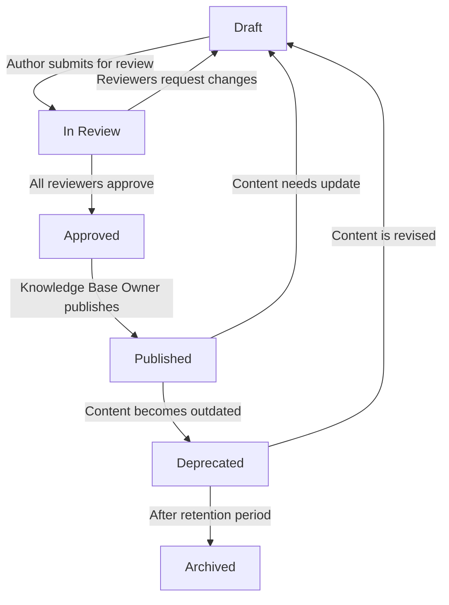

# Document Lifecycle

This document defines the lifecycle stages that every document passes through, from initial creation to eventual archival. It specifies the transitions, responsibilities, and governance at each stage.

---

## Lifecycle Stages



---

## Stage Definitions

### Draft

| Attribute | Value |
|---|---|
| **Metadata Status** | `status: "draft"` |
| **Description** | Document is being created or revised |
| **Who Can Create** | Technical Writer, Banking SME (with writer support) |
| **Visibility** | Not visible to customers or the RAG system |
| **Actions Allowed** | Edit content, update metadata, add cross-references |
| **Exit Criteria** | Author completes self-review checklist |
| **Next Stage** | In Review |

---

### In Review

| Attribute | Value |
|---|---|
| **Metadata Status** | `status: "in-review"` |
| **Description** | Document is under review by designated reviewers |
| **Who Reviews** | Technical Writer, SME, Compliance Lead (per review process) |
| **Visibility** | Not visible to customers or the RAG system |
| **Actions Allowed** | Reviewers comment and request changes; author revises |
| **Exit Criteria** | All required approvals received |
| **Next Stage** | Approved (if approved) or Draft (if changes requested) |

---

### Approved

| Attribute | Value |
|---|---|
| **Metadata Status** | `status: "approved"` |
| **Description** | Document has passed all reviews and is ready for publishing |
| **Who Approves** | Knowledge Base Owner (final gate) |
| **Visibility** | Not yet visible to customers; may be used for pre-launch testing |
| **Actions Allowed** | Minor edits (typos only); substantive changes return to Draft |
| **Exit Criteria** | Knowledge Base Owner authorises publication |
| **Next Stage** | Published |

---

### Published

| Attribute | Value |
|---|---|
| **Metadata Status** | `status: "published"` |
| **Description** | Document is live and available to customers and the RAG system |
| **Who Owns** | Document Owner (as specified in metadata) |
| **Visibility** | Visible to customers and indexed by the RAG system |
| **Actions Allowed** | Content updates (return to Draft), minor corrections (stay Published) |
| **Maintenance** | Subject to scheduled reviews per maintenance strategy |
| **Next Stage** | Draft (for updates) or Deprecated (when outdated) |

---

### Deprecated

| Attribute | Value |
|---|---|
| **Metadata Status** | `status: "deprecated"` |
| **Description** | Document is outdated and should no longer be the primary source |
| **Who Deprecates** | Document Owner or Knowledge Base Owner |
| **Visibility** | May still be visible with a deprecation banner; RAG system deprioritises |
| **Required Action** | Add deprecation notice pointing to the replacement document |
| **Retention Period** | 6 months before archival (configurable) |
| **Next Stage** | Archived or Draft (if being revised) |

**Deprecation Notice Format:**

```markdown
> **Warning:** This document was deprecated on [date]. 
> For current information, see [Replacement Document](path/to/replacement.md).
```

---

### Archived

| Attribute | Value |
|---|---|
| **Metadata Status** | `status: "archived"` |
| **Description** | Document is no longer active; retained for historical reference |
| **Who Archives** | Knowledge Base Owner |
| **Visibility** | Not visible to customers; not indexed by the RAG system |
| **Storage** | Remains in the repository (Git history preserves all versions) |
| **Retrieval** | Available through Git history if needed |

---

## Lifecycle Transitions

| From | To | Trigger | Responsible |
|---|---|---|---|
| Draft | In Review | Author submits PR | Author |
| In Review | Draft | Reviewer requests changes | Reviewer |
| In Review | Approved | All required approvals received | Last reviewer |
| Approved | Published | KB Owner authorises | Knowledge Base Owner |
| Published | Draft | Content update needed | Document Owner |
| Published | Deprecated | Content is outdated or replaced | Document Owner / KB Owner |
| Deprecated | Draft | Content is being revised for republication | Document Owner |
| Deprecated | Archived | Retention period expires | Knowledge Base Owner |

---

## Responsibilities by Stage

| Role | Draft | In Review | Approved | Published | Deprecated | Archived |
|---|---|---|---|---|---|---|
| **Author** | Create/edit | Respond to feedback | Minor fixes | — | — | — |
| **Technical Writer** | Review | Review | — | Monitor quality | Add deprecation notice | — |
| **SME** | Provide content | Review accuracy | — | Keep content current | Identify replacements | — |
| **Compliance** | — | Review (if applicable) | — | Flag regulatory changes | — | — |
| **KB Owner** | — | Final approval | Authorise publication | Oversee maintenance | Approve deprecation | Approve archival |

---

## Automated Status Tracking

The `status` field in YAML frontmatter is the source of truth:

```yaml
status: "published"
```

### Automated Alerts

| Condition | Alert |
|---|---|
| Document in `draft` for > 30 days | Notify author and KB Owner |
| Document in `in-review` for > 7 days | Notify reviewer |
| Published document with `last_reviewed` > 90 days | Flag for review |
| Deprecated document past retention period | Notify KB Owner for archival |

---

## Related Documents

- [Review Process](review-process.md) — Detailed review workflow and checklists
- [Maintenance Strategy](maintenance-strategy.md) — Update schedules and staleness detection
- [Versioning Policy](versioning-policy.md) — How versions change through the lifecycle
- [Metadata Schema](../metadata/metadata-schema.md) — `status`, `last_updated`, and `last_reviewed` fields

---

*Last updated: 2026-08-02*
