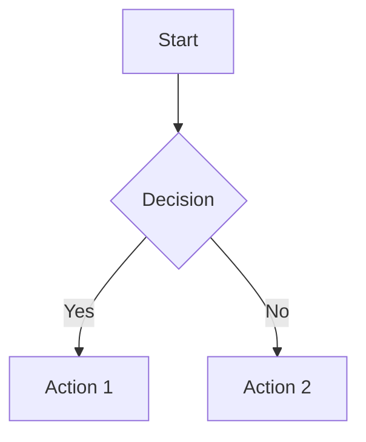

# Documentation Standards

This document defines the Markdown formatting rules, structural conventions, and layout standards for all documents in the knowledge base.

---

## Document Structure

Every document must follow this general structure:

```
1. YAML Frontmatter (metadata)
2. Document Title (H1)
3. Overview section
4. Main content sections (H2, H3, H4)
5. Related Documents section
6. Last Updated footer
```

### Required Sections

The following sections must appear in **every** document (unless a template specifies otherwise):

| Section | Heading Level | Purpose |
|---|---|---|
| Title | H1 | Single H1 at the top of the document |
| Overview | H2 | Brief summary of what the document covers |
| [Content sections] | H2/H3/H4 | Main body — varies by document type |
| Related Documents | H2 | Cross-references to related documents |
| Last Updated | Footer | Date of last modification |

---

## Heading Hierarchy

### Rules

1. **One H1 per document** — the document title
2. **H2 for major sections** — each major topic within the document
3. **H3 for sub-sections** — breakdowns within a major section
4. **H4 for details** — rarely needed; use only when H3 creates sub-topics
5. **Never skip levels** — do not jump from H2 to H4
6. **Use descriptive headings** — headings should read like questions a customer might ask

### Heading Format

- Use **Title Case** for H1 and H2 headings
- Use **Sentence case** for H3 and H4 headings
- Do not end headings with punctuation
- Do not use special characters in headings (except hyphens and ampersands)

### Examples

```markdown
# Savings Account                          ← H1 (Title Case)

## Overview                                ← H2 (Title Case)

## Features and Benefits                   ← H2 (Title Case)

### Interest rate structure                 ← H3 (Sentence case)

### Minimum balance requirements            ← H3 (Sentence case)

## Eligibility                             ← H2 (Title Case)

## Required Documents                      ← H2 (Title Case)

## Related Documents                       ← H2 (Title Case)
```

---

## YAML Frontmatter

Every document must begin with a YAML frontmatter block enclosed in triple dashes:

```yaml
---
id: "CATEGORY-SUBCATEGORY-NNN"
title: "Document Title"
category: "category-name"
# ... additional fields per metadata schema
---
```

The full metadata schema is defined in [metadata/README.md](../metadata/README.md) (Phase 2).

---

## Markdown Conventions

### Emphasis

| Style | Syntax | Use Case |
|---|---|---|
| **Bold** | `**text**` | Key terms, important values, product names on first mention |
| *Italic* | `*text*` | Emphasis, defined terms, document titles |
| `Code` | `` `text` `` | Technical values, field names, configuration values |

### Rules

- Do not combine bold and italic (`***text***`) — choose one
- Do not use bold for entire sentences or paragraphs
- Use bold sparingly — if everything is bold, nothing stands out
- Use code formatting for: amounts with specific values, document IDs, metadata field names

---

## Lists

### Bullet Lists

Use for unordered items:

```markdown
- First item
- Second item
- Third item
```

- Use hyphens (`-`) as the bullet character (not `*` or `+`)
- Maintain consistent indentation (2 spaces for nested items)
- Do not nest more than 2 levels deep

### Numbered Lists

Use for sequential steps or ordered processes:

```markdown
1. First step
2. Second step
3. Third step
```

- Always use explicit numbering (1, 2, 3) — not all `1.`
- Keep step descriptions actionable ("Open the mobile app" not "The mobile app should be opened")

### Definition Lists

For term-definition pairs, use bold term followed by a description:

```markdown
**Term**: Definition of the term.

**Another Term**: Definition of another term.
```

---

## Tables

### When to Use Tables

- Reference data (interest rates, charges, limits)
- Feature comparisons
- Eligibility criteria
- Document checklists
- Status information

### Table Format

```markdown
| Column Header | Column Header | Column Header |
|---|---|---|
| Cell content | Cell content | Cell content |
| Cell content | Cell content | Cell content |
```

### Table Rules

- Always include a header row
- Use `N/A` for cells with no applicable value (never leave blank)
- Keep cell content concise — link to details if needed
- Align monetary values to the right where possible
- Use consistent units within a column

---

## Links and Cross-References

### Internal Links

Link to other documents in the knowledge base using **relative paths**:

```markdown
See the [Savings Account](../accounts/savings-account.md) documentation.
```

### Cross-Reference Format

At the end of every document, include a **Related Documents** section:

```markdown
## Related Documents

- [Savings Account](../accounts/savings-account.md) — Account features and eligibility
- [Deposit Interest Rates](../interest-rates/deposit-interest-rates.md) — Current interest rate schedule
- [Account Opening Documents](../forms/account-opening-documents.md) — Required documents
```

### Link Rules

- Use **descriptive link text** — never use "click here" or "this document"
- Include a brief description after each link in the Related Documents section
- Verify all links are valid before submitting
- Use relative paths, not absolute paths

---

## Admonitions (Callouts)

Use admonitions to highlight important information that stands apart from the main text.

### Supported Types

**Note** — Additional context or background information:

```markdown
> **Note:** Interest rates are subject to change. Check the latest rates on the Bank's website.
```

**Important** — Critical information the customer must know:

```markdown
> **Important:** You must complete KYC verification within 30 days of account opening.
```

**Warning** — Information about risks or negative consequences:

```markdown
> **Warning:** Failure to maintain the minimum balance will result in a monthly penalty of ₹500.
```

**Tip** — Helpful suggestions or best practices:

```markdown
> **Tip:** Link your Aadhaar to your account for faster KYC verification and to enable UPI payments.
```

### Admonition Rules

- Use admonitions **sparingly** — no more than 2–3 per document
- Do not use admonitions for information that belongs in the main text
- Do not stack multiple admonitions consecutively
- Always use the appropriate type (do not use "Note" for warnings)

---

## Code Blocks

Use code blocks only for:

- Technical values or configuration examples
- API references (in future technical documentation)
- Example YAML metadata

Format:

````markdown
```yaml
field_name: "value"
```
````

Do not use code blocks for:

- Regular customer-facing content
- Lists of documents or steps
- Product names or banking terms

---

## Horizontal Rules

Use horizontal rules (`---`) to separate major sections visually:

```markdown
## Section One

Content...

---

## Section Two

Content...
```

### Rules

- Use `---` (three hyphens) on its own line
- Always leave a blank line before and after the horizontal rule
- Use between major H2 sections, not between every section

---

## Images and Diagrams

### Embedding Images

```markdown

```

### Mermaid Diagrams

For process flows and decision trees, use Mermaid diagrams inline:

````markdown

````

### Rules

- Every image must have a descriptive alt text
- Store all images in the `assets/` directory
- Use SVG for diagrams where possible
- Keep diagrams simple and readable

---

## Document Footer

Every document must end with:

```markdown
---

*Last updated: YYYY-MM-DD*
```

---

## Checklist for Authors

Before submitting a document, verify:

- [ ] Single H1 heading at the top
- [ ] YAML frontmatter is complete and valid
- [ ] Heading hierarchy follows the rules (no skipped levels)
- [ ] All lists use consistent formatting
- [ ] All tables have header rows
- [ ] All internal links use relative paths and are valid
- [ ] Admonitions are used sparingly and correctly
- [ ] Related Documents section is present
- [ ] Last Updated footer is present
- [ ] No spelling or grammar errors

---

## Related Documents

- [Style Guide](style-guide.md) — Writing tone and language standards
- [Naming Conventions](naming-conventions.md) — File and folder naming rules
- [Repository Rules](repository-rules.md) — Core content rules
- [Review Process](review-process.md) — Review checklist for reviewers

---

*Last updated: 2026-08-02*
