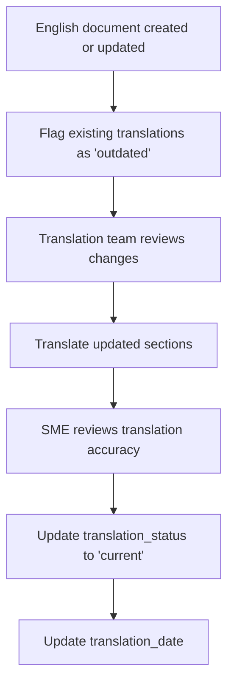

# Multilingual Strategy

This document defines the architecture for future multilingual support in the knowledge base. No translations are being created at this stage — this document establishes the design decisions and conventions to ensure smooth expansion when the time comes.

---

## Current State

- All documents are written in **English** (`en`)
- The regional context is **India** (`IN`)
- All metadata includes `language: "en"` and `region: "IN"` fields

---

## Supported Languages (Future)

When multilingual support is implemented, the following languages are anticipated:

| Language | ISO 639-1 Code | Priority |
|---|---|---|
| English | `en` | Primary (current) |
| Hindi | `hi` | High |
| Tamil | `ta` | Medium |
| Telugu | `te` | Medium |
| Kannada | `kn` | Medium |
| Malayalam | `ml` | Medium |
| Bengali | `bn` | Medium |
| Marathi | `mr` | Medium |
| Gujarati | `gu` | Medium |

---

## Folder Structure for Multilingual Content

### Option Considered: Separate Language Folders

```
docs/
├── en/
│   └── accounts/
│       └── savings-account.md
├── hi/
│   └── accounts/
│       └── savings-account.md
```

### Option Chosen: Language Suffix in Filenames

```
docs/
└── accounts/
    ├── savings-account.md           ← English (default)
    ├── savings-account.hi.md        ← Hindi
    ├── savings-account.ta.md        ← Tamil
```

**Rationale:**
- Keeps related translations close together in the file system
- Easier to see which documents have translations and which do not
- Avoids deep folder nesting
- Default language (English) uses no suffix for backward compatibility
- This is the more common pattern in documentation systems (e.g., Hugo, Docusaurus)

---

## Shared Identifiers

Translated documents share the **same document ID** with a language suffix:

| Language | Document ID | Filename |
|---|---|---|
| English | `ACCT-SA-001` | `savings-account.md` |
| Hindi | `ACCT-SA-001.hi` | `savings-account.hi.md` |
| Tamil | `ACCT-SA-001.ta` | `savings-account.ta.md` |

### Metadata for Translations

```yaml
---
id: "ACCT-SA-001.hi"
title: "बचत खाता"
slug: "savings-account"
language: "hi"
region: "IN"
translation_of: "ACCT-SA-001"        # Points to the English canonical version
translation_status: "current"          # current, outdated, in-progress
translation_date: "2026-10-15"
---
```

### New Metadata Fields for Translations

| Field | Type | Description |
|---|---|---|
| `translation_of` | String | Document ID of the English canonical version |
| `translation_status` | Enum | `current`, `outdated`, `in-progress` |
| `translation_date` | Date | When the translation was last synchronised with the English version |

---

## Translation Workflow



### Rules

1. **English is always the canonical source** — translations derive from English documents
2. Translations must track which **English version** they are based on
3. When the English document is updated, all translations are automatically flagged as `outdated`
4. Translation teams update translations and reset the status to `current`
5. A translation must never be updated independently of the English source (except for typo fixes)

---

## What Gets Translated

| Content Type | Translate? | Notes |
|---|---|---|
| Product documents | Yes | Full translation |
| FAQs | Yes | High priority — direct customer interactions |
| Scenarios | Yes | Customer-facing journeys |
| Decision guides | Yes | Help customers choose products |
| Glossary | Yes | Term definitions in local language |
| Policies | Partial | Regulatory content may need legal review |
| Governance documents | No | Internal standards remain in English |
| Templates | No | Structural scaffolding stays in English |
| Metadata schema | No | Technical specification stays in English |
| Charges and rates | Partial | Numbers are universal; labels may be translated |

---

## Content That Should NOT Be Translated

- Document IDs
- YAML field names
- Tag values (always English)
- File and folder names (always English)
- Git commit messages
- Governance and template documents

---

## Localisation Considerations

Beyond translation, some content may need localisation:

| Aspect | Localisation Needed? | Notes |
|---|---|---|
| Currency format | No | ₹ format is consistent across Indian languages |
| Date format | Possibly | Some languages prefer different date orderings |
| Number format | No | Indian numbering system (lakhs, crores) is used across languages |
| Banking terms | Yes | Banking terminology varies by language |
| Regulatory references | No | RBI circular numbers are universal |

---

## Related Documents

- [Metadata Schema](../metadata/metadata-schema.md) — `language`, `region`, and future translation fields
- [Naming Conventions](naming-conventions.md) — File naming with language suffixes
- [Maintenance Strategy](maintenance-strategy.md) — How translations fit into the update cycle

---

*Last updated: 2026-08-02*
