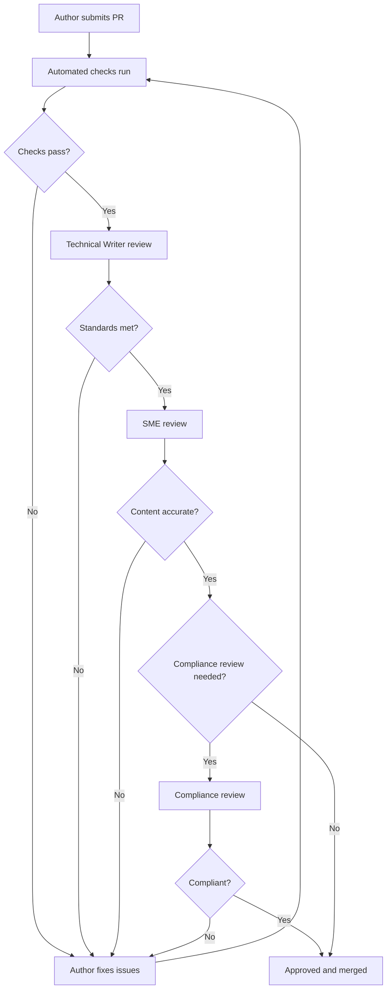

# Review Process

This document defines the review workflow, roles, and quality checklist for all changes to the knowledge base.

---

## Review Objectives

Every review must verify that content is:

1. **Accurate** — Factually correct and aligned with current banking practices
2. **Complete** — All required sections and metadata are present
3. **Consistent** — Follows established standards and terminology
4. **Customer-Friendly** — Written in clear, simple language
5. **AI-Ready** — Structured for effective retrieval and chunking

---

## Review Roles

| Role | Responsibility | Required For |
|---|---|---|
| **Technical Writer Reviewer** | Language, formatting, structure, and standards compliance | All changes |
| **Subject Matter Expert (SME)** | Factual accuracy of banking content | New documents, content updates |
| **Compliance Reviewer** | Regulatory accuracy and policy alignment | Policy documents, loan terms, charges |
| **Knowledge Base Owner** | Final approval, structural decisions, governance changes | Structural changes, governance updates |
| **AI Engineering Reviewer** | Metadata quality, retrieval optimisation | Metadata changes, new document types |

---

## Review Workflow

### Standard Review (New Documents and Content Updates)

### Fast-Track Review (Minor Corrections)

For typos, grammatical fixes, and link corrections:

1. Technical Writer Reviewer approves
2. No SME or Compliance review required
3. Must still pass automated checks

### Governance Review (Standards and Structure Changes)

For changes to governance documents, templates, or folder structure:

1. Knowledge Base Owner must approve
2. All impacts to existing documents must be assessed
3. Migration plan required if changes affect existing documents

---

## Automated Checks

The following checks run automatically on every pull request:

| Check | What It Verifies |
|---|---|
| **YAML Validation** | Frontmatter parses correctly and all required fields are present |
| **Link Validation** | All internal links point to existing files |
| **Markdown Lint** | Consistent formatting per documentation standards |
| **Spelling Check** | No common spelling errors (with banking terminology allowlist) |
| **ID Uniqueness** | No duplicate document IDs across the repository |
| **File Naming** | Files follow naming conventions |

---

## Review Checklist

### For Technical Writer Reviewers

**Structure:**
- [ ] Document follows the correct template
- [ ] Single H1 heading at the top
- [ ] Heading hierarchy is correct (no skipped levels)
- [ ] All required sections are present
- [ ] Related Documents section is complete

**Language:**
- [ ] Follows the style guide (tone, voice, grammar)
- [ ] Customer-friendly language throughout
- [ ] No marketing language or promotional content
- [ ] No internal jargon without explanation
- [ ] Abbreviations spelled out on first use

**Formatting:**
- [ ] YAML frontmatter is complete and valid
- [ ] Lists are formatted consistently
- [ ] Tables have header rows and no blank cells
- [ ] Admonitions used correctly and sparingly
- [ ] Last Updated footer is present

**Cross-References:**
- [ ] No duplicated content (cross-references used instead)
- [ ] All internal links are valid and use relative paths
- [ ] Document is self-contained and understandable independently

### For SME Reviewers

- [ ] All banking information is factually accurate
- [ ] Interest rates, charges, and limits are current
- [ ] Eligibility criteria are correct
- [ ] Process steps are accurate and complete
- [ ] Regulatory references are correct
- [ ] No misleading or incomplete information

### For Compliance Reviewers

- [ ] Content aligns with current RBI guidelines
- [ ] Fair Practice Code requirements are met
- [ ] Customer rights are correctly stated
- [ ] Regulatory references cite correct circulars
- [ ] No content that could create legal liability

### For AI Engineering Reviewers

- [ ] Document ID follows the naming convention
- [ ] Keywords are relevant and comprehensive
- [ ] Category and sub-category are accurate
- [ ] Related documents are correctly linked
- [ ] Content is structured for effective chunking
- [ ] Headings are descriptive and match potential customer queries

---

## Review SLAs

| Review Type | Target Turnaround |
|---|---|
| Fast-track (minor corrections) | 1 working day |
| Standard (new documents, updates) | 3 working days |
| Compliance review | 5 working days |
| Governance changes | 5 working days |

---

## Handling Review Feedback

### For Authors

1. Address all review comments — do not ignore feedback
2. If you disagree with feedback, explain your reasoning in the PR comments
3. Request re-review after making changes
4. Do not merge without required approvals

### For Reviewers

1. Be specific — point to exact lines and explain what needs to change
2. Distinguish between **must-fix** (blocking) and **nice-to-have** (non-blocking) feedback
3. Approve promptly when all issues are resolved
4. If unsure about content accuracy, escalate to the appropriate SME

---

## Post-Merge Verification

After merging:

1. Verify the document appears correctly in the repository
2. Confirm all links in the merged document work
3. Check that any updated cross-references in other documents are correct
4. Update [CHANGELOG.md](../CHANGELOG.md) if the change is significant

---

## Related Documents

- [Contribution Guide](contribution-guide.md) — How to prepare and submit documentation
- [Documentation Standards](documentation-standards.md) — Formatting rules reviewers check against
- [Style Guide](style-guide.md) — Language rules reviewers check against
- [Repository Rules](repository-rules.md) — Core rules that must be followed
- [CODEOWNERS](../CODEOWNERS) — Who reviews what

---

*Last updated: 2026-08-02*
