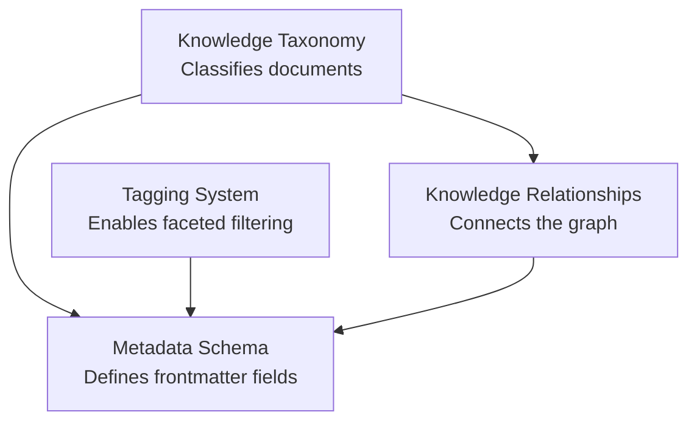

# Metadata Documentation

This folder contains the knowledge architecture specifications that define how documents are classified, tagged, related, and optimised for AI retrieval.

---

## Documents

| Document | Description |
|---|---|
| [knowledge-taxonomy.md](knowledge-taxonomy.md) | Complete classification hierarchy (domains, categories, subcategories, document types) |
| [metadata-schema.md](metadata-schema.md) | YAML frontmatter schema with 30+ fields, validation rules, and complete examples |
| [tagging-system.md](tagging-system.md) | Structured tagging strategy with 10 namespaces and controlled vocabulary |
| [knowledge-relationships.md](knowledge-relationships.md) | How documents connect: relationship types, graph patterns, and implementation |

---

## How These Documents Work Together

1. The **Knowledge Taxonomy** defines the classification hierarchy
2. The **Metadata Schema** translates that hierarchy into YAML fields every document carries
3. The **Tagging System** adds multi-dimensional classification for retrieval filtering
4. The **Knowledge Relationships** define how documents connect, which is encoded in the metadata `related_documents` field

---

## For AI Engineers

These documents define the structure that the future RAG system will leverage:

- **Taxonomy** → Category-based filtering and routing
- **Metadata** → Structured fields for hybrid search and faceted filtering
- **Tags** → Multi-dimensional classification for retrieval refinement
- **Relationships** → Knowledge graph edges for contextual retrieval
- **Keywords and Search Aliases** → Query expansion and semantic matching

---

## Related Resources

- [governance/](../governance/) — Standards for writing and maintaining documents
- [templates/](../templates/) — Templates that implement this metadata schema
- [governance/chunking-guidelines.md](../governance/chunking-guidelines.md) — How content structure supports chunking
- [governance/search-optimization-guide.md](../governance/search-optimization-guide.md) — How metadata supports retrieval

---

*Last updated: 2026-08-02*
