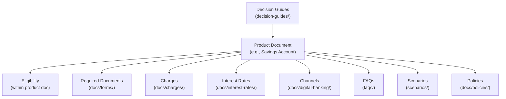
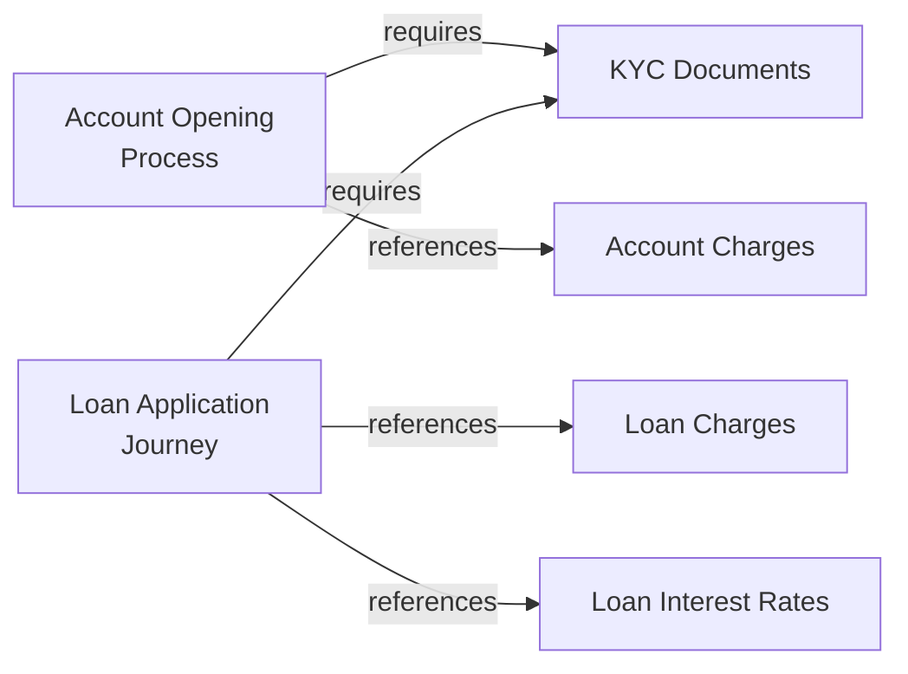
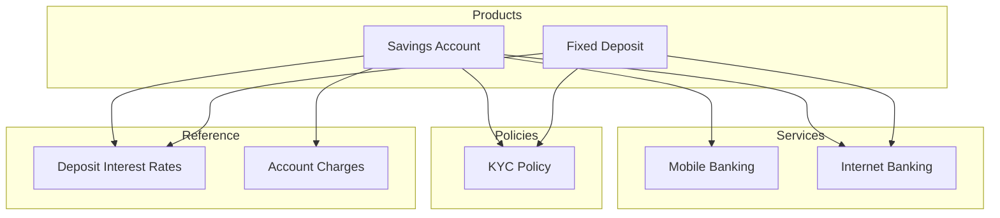

# Knowledge Relationships

This document defines how documents in the knowledge base connect to one another conceptually. These relationships form a knowledge graph that enables intelligent navigation, context-aware retrieval, and comprehensive answer generation.

---

## Relationship Types

### 1. Product-Centric Relationships

Every banking product sits at the centre of a relationship web:



**How it works:**
- The **product document** is the canonical source for features, eligibility, and processes
- **Charges** and **interest rates** live in separate reference documents (single source of truth)
- **FAQs** link back to the product for detailed answers
- **Scenarios** reference the product when walking through a customer journey
- **Decision guides** compare multiple products and link to each one

---

### 2. Hierarchical Relationships (Parent-Child)

Some documents have a natural parent-child hierarchy:

| Parent | Child | Example |
|---|---|---|
| Product document | Troubleshooting guide | Savings Account → Savings Account Troubleshooting |
| Category FAQ | Individual FAQ entries | Accounts FAQ contains entries about all account types |
| Policy document | Related process guide | KYC Policy → KYC Document Submission Process |

**Implementation:**
- Child documents set the `parent_document` field in their metadata
- Parent documents list children in their `related_documents` field
- Hierarchy is limited to **two levels** (parent → child) to keep things simple

---

### 3. Peer Relationships (See Also)

Documents at the same level often relate to each other:

| Document A | Relationship | Document B |
|---|---|---|
| Savings Account | Same category | Current Account |
| NEFT | Alternative payment method | RTGS, IMPS |
| Credit Card | Complementary product | Debit Card |
| KYC Policy | Prerequisite | Account Opening Documents |
| Fraud Prevention | Complements | Safe Banking Tips |

**Implementation:**
- Both documents list each other in their `related_documents` field
- The Related Documents section at the end of each document includes a brief description of the relationship

---

### 4. Dependency Relationships

Some documents depend on information from others:



| Dependent Document | Dependency Type | Source Document |
|---|---|---|
| Account opening process | Requires | KYC Documents list |
| Loan product document | References | Loan interest rates |
| Product document | References | Charge schedule |
| FAQ answer | Summarises | Product document |
| Scenario | Orchestrates | Multiple product/process documents |

**Rules:**
- Dependencies point **from the dependent to the source**
- The source document does not need to know about all its dependents
- If a source document changes, dependents should be reviewed (tracked via `related_documents`)

---

### 5. Cross-Domain Relationships

Some knowledge spans multiple domains:



---

## Relationship Registry

The following table defines all standard relationship types:

| Relationship | Direction | Description | Example |
|---|---|---|---|
| `references` | A → B | A mentions or links to information in B | Product → Charges document |
| `requires` | A → B | A depends on B being completed first | Account Opening → KYC Documents |
| `complements` | A ↔ B | A and B cover related but distinct topics | Fraud Prevention ↔ Safe Banking Tips |
| `alternative-to` | A ↔ B | A and B are alternative options | NEFT ↔ RTGS ↔ IMPS |
| `parent-of` | A → B | A is the parent document of B | Product → Product Troubleshooting |
| `supersedes` | A → B | A replaces the deprecated document B | New Policy → Old Policy |
| `summarises` | A → B | A contains a brief version of B's content | FAQ Answer → Product Document |
| `compares` | A → B, C, D | A compares multiple products | Decision Guide → Multiple Products |

---

## Knowledge Graph Patterns

### Pattern 1 — Product Knowledge Cluster

Every product forms a knowledge cluster:

```
Product Document
├── references → Charges Document
├── references → Interest Rate Document
├── references → Required Documents
├── references → Digital Channel Documents
├── complements → Related Product Documents
├── parent-of → Troubleshooting Guide (if exists)
└── summarised-by → FAQ Document
    └── summarised-by → Decision Guide
```

### Pattern 2 — Customer Journey Chain

Scenarios create chains across documents:

```
Decision Guide (choose a product)
  → Product Document (learn about it)
    → Required Documents (gather paperwork)
      → Application Process (apply)
        → Charges Document (understand fees)
          → FAQ (get answers to remaining questions)
```

### Pattern 3 — Regulatory Web

Policy documents connect regulatory requirements to affected products:

```
RBI Guideline
  → KYC Policy
    → Account Opening (requires KYC)
    → Loan Application (requires KYC)
    → Card Application (requires KYC)
```

---

## Implementing Relationships

### In Metadata

Use the `related_documents` field for all relationships:

```yaml
related_documents:
  - "RATE-DEP-001"    # Interest rates (references)
  - "CHG-ACCT-001"    # Account charges (references)
  - "FORM-ACCT-001"   # Required documents (requires)
  - "ACCT-CA-001"     # Current Account (alternative-to)
  - "FAQ-ACCT-001"    # Accounts FAQ (summarised-by)
```

Use `parent_document` for hierarchical relationships:

```yaml
parent_document: "ACCT-SA-001"
```

### In Document Body

Use the **Related Documents** section at the end of each document:

```markdown
## Related Documents

- [Current Account](../accounts/current-account.md) — Alternative account type for business transactions
- [Account Charges](../charges/account-charges.md) — Complete fee schedule for account operations
- [Deposit Interest Rates](../interest-rates/deposit-interest-rates.md) — Current interest rate table
- [Account Opening Documents](../forms/account-opening-documents.md) — Required documents for account opening
- [Accounts FAQ](../../faqs/accounts-faq.md) — Frequently asked questions about accounts
```

### Relationship Maintenance

- When creating a new document, update the `related_documents` of all connected documents
- When deprecating a document, update all documents that reference it
- Run periodic link validation to catch broken relationships
- The Knowledge Base Owner reviews the relationship graph quarterly

---

## Future: Knowledge Graph

In the future RAG system, these relationships may become:

- **Graph database edges** between document nodes
- **Contextual retrieval paths** that provide related information alongside primary results
- **Navigation suggestions** ("You might also want to know about...")
- **Answer composition** combining information from multiple related documents

The relationship metadata defined here provides the foundation for this graph.

---

## Related Documents

- [Metadata Schema](metadata-schema.md) — Fields that encode relationships
- [Cross-Reference Strategy](../governance/cross-reference-strategy.md) — Rules for linking documents
- [Knowledge Taxonomy](knowledge-taxonomy.md) — Classification hierarchy these relationships span
- [Duplicate Prevention](../governance/duplicate-prevention.md) — When to reference vs. duplicate

---

*Last updated: 2026-08-02*
