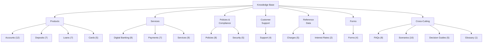

# Master Knowledge Map

This document provides a complete architectural view of the knowledge base — every domain, category, subcategory, and individual document.

---

## Knowledge Architecture Overview

---

## Complete Document Inventory

### Domain 1 — Products (24 documents)

#### Accounts (`docs/accounts/`) — 12 documents

| ID | Document | File | Priority | Phase |
|---|---|---|---|---|
| ACCT-SA-001 | Savings Account | `savings-account.md` | High | 4 |
| ACCT-CA-001 | Current Account | `current-account.md` | High | 4 |
| ACCT-SAL-001 | Salary Account | `salary-account.md` | High | 4 |
| ACCT-STU-001 | Student Account | `student-account.md` | Medium | 4 |
| ACCT-SC-001 | Senior Citizen Account | `senior-citizen-account.md` | Medium | 4 |
| ACCT-BSBDA-001 | Basic Savings Bank Deposit Account (BSBDA) | `bsbda.md` | High | 5 |
| ACCT-JNT-001 | Joint Account | `joint-account.md` | High | 5 |
| ACCT-MIN-001 | Minor Account | `minor-account.md` | High | 5 |
| ACCT-NRE-001 | NRE Account | `nre-account.md` | High | 5 |
| ACCT-NRO-001 | NRO Account | `nro-account.md` | High | 5 |
| ACCT-FCNR-001 | FCNR Account | `fcnr-account.md` | Medium | 5 |
| ACCT-PMJDY-001 | PMJDY Account | `pmjdy-account.md` | High | 5 |

#### Deposits (`docs/deposits/`) — 7 documents

| ID | Document | File | Priority | Phase |
|---|---|---|---|---|
| DEP-FD-001 | Fixed Deposit | `fixed-deposit.md` | High | 4 |
| DEP-RD-001 | Recurring Deposit | `recurring-deposit.md` | High | 4 |
| DEP-TS-001 | Tax Saver Fixed Deposit | `tax-saver-deposit.md` | Medium | 4 |
| DEP-SC-001 | Senior Citizen Fixed Deposit | `senior-citizen-deposit.md` | High | 6 |
| DEP-FLX-001 | Flexi / Sweep Deposit | `flexi-deposit.md` | Medium | 6 |
| DEP-NRE-001 | NRE Fixed Deposit | `nre-fixed-deposit.md` | High | 6 |
| DEP-NRO-001 | NRO Fixed Deposit | `nro-fixed-deposit.md` | High | 6 |

#### Loans (`docs/loans/`) — 7 documents

| ID | Document | File | Priority | Phase |
|---|---|---|---|---|
| LOAN-HL-001 | Home Loan | `home-loan.md` | High | 4 |
| LOAN-PL-001 | Personal Loan | `personal-loan.md` | High | 4 |
| LOAN-EL-001 | Education Loan | `education-loan.md` | High | 4 |
| LOAN-VL-001 | Vehicle Loan | `vehicle-loan.md` | High | 4 |
| LOAN-GL-001 | Gold Loan | `gold-loan.md` | Medium | 4 |
| LOAN-BL-001 | Business Loan | `business-loan.md` | High | 4 |
| LOAN-LAP-001 | Loan Against Property | `loan-against-property.md` | Medium | 4 |

#### Cards (`docs/cards/`) — 5 documents

| ID | Document | File | Priority | Phase |
|---|---|---|---|---|
| CARD-CC-001 | Credit Card | `credit-card.md` | High | 4 |
| CARD-DC-001 | Debit Card | `debit-card.md` | High | 4 |
| CARD-PC-001 | Prepaid Card | `prepaid-card.md` | Medium | 4 |
| CARD-VC-001 | Virtual Card | `virtual-card.md` | Medium | 4 |
| CARD-FC-001 | Forex Card | `forex-card.md` | Medium | 4 |

---

### Domain 2 — Services (24 documents)

#### Digital Banking (`docs/digital-banking/`) — 8 documents

| ID | Document | File | Priority | Phase |
|---|---|---|---|---|
| DIGI-MB-001 | Mobile Banking | `mobile-banking.md` | High | 4 |
| DIGI-IB-001 | Internet Banking | `internet-banking.md` | High | 4 |
| DIGI-UPI-001 | UPI | `upi.md` | High | 4 |
| DIGI-QR-001 | QR Payments | `qr-payments.md` | Medium | 4 |
| DIGI-BP-001 | Bill Payments | `bill-payments.md` | Medium | 4 |
| DIGI-MB-TS-001 | Mobile Banking Troubleshooting | `mobile-banking-troubleshooting.md` | High | 5 |
| DIGI-IB-TS-001 | Internet Banking Troubleshooting | `internet-banking-troubleshooting.md` | High | 5 |
| DIGI-UPI-TS-001 | UPI Troubleshooting | `upi-troubleshooting.md` | High | 5 |

#### Payments (`docs/payments/`) — 7 documents

| ID | Document | File | Priority | Phase |
|---|---|---|---|---|
| PAY-NEFT-001 | NEFT | `neft.md` | High | 4 |
| PAY-RTGS-001 | RTGS | `rtgs.md` | High | 4 |
| PAY-IMPS-001 | IMPS | `imps.md` | High | 4 |
| PAY-SWIFT-001 | SWIFT Transfer | `swift.md` | Medium | 4 |
| PAY-CHQ-001 | Cheque Services | `cheque-services.md` | Medium | 4 |
| PAY-DD-001 | Demand Draft | `demand-draft.md` | Low | 5 |
| PAY-TS-001 | Payment Troubleshooting | `payment-troubleshooting.md` | High | 5 |

#### Banking Services (`docs/services/`) — 9 documents

| ID | Document | File | Priority | Phase |
|---|---|---|---|---|
| SVC-ATM-001 | ATM Services | `atm-services.md` | Medium | 4 |
| SVC-LOCK-001 | Locker Facility | `locker-facility.md` | Medium | 4 |
| SVC-NOM-001 | Nomination | `nomination.md` | Medium | 4 |
| SVC-ADDR-001 | Address Update | `address-update.md` | Medium | 4 |
| SVC-MOB-001 | Mobile Number Update | `mobile-number-update.md` | Medium | 4 |
| SVC-CLOSE-001 | Account Closure | `account-closure.md` | Medium | 4 |
| SVC-REACT-001 | Account Reactivation | `account-reactivation.md` | Medium | 4 |
| SVC-STMT-001 | Statement Requests | `statement-requests.md` | Medium | 4 |
| SVC-PB-001 | Passbook Services | `passbook-services.md` | Low | 5 |

---

### Domain 3 — Policies and Compliance (13 documents)

#### Policies (`docs/policies/`) — 8 documents

| ID | Document | File | Priority | Phase |
|---|---|---|---|---|
| POL-KYC-001 | KYC Policy | `kyc-policy.md` | High | 4 |
| POL-CLOSE-001 | Account Closure Policy | `account-closure-policy.md` | Medium | 4 |
| POL-DORM-001 | Dormant Account Policy | `dormant-account-policy.md` | Medium | 4 |
| POL-GRIEV-001 | Grievance Redressal Policy | `grievance-redressal-policy.md` | High | 4 |
| POL-FPC-001 | Fair Practice Code | `fair-practice-code.md` | Medium | 4 |
| POL-PRIV-001 | Privacy Policy | `privacy-policy.md` | Medium | 4 |
| POL-CHQ-001 | Cheque Return Policy | `cheque-return-policy.md` | Medium | 4 |
| POL-RECOV-001 | Loan Recovery Policy | `loan-recovery-policy.md` | Medium | 4 |

#### Security (`docs/security/`) — 5 documents

| ID | Document | File | Priority | Phase |
|---|---|---|---|---|
| SEC-GUIDE-001 | Security Guidelines | `security-guidelines.md` | High | 4 |
| SEC-FRAUD-001 | Fraud Prevention | `fraud-prevention.md` | Critical | 4 |
| SEC-SAFE-001 | Safe Banking Tips | `safe-banking-tips.md` | High | 4 |
| SEC-PHISH-001 | Phishing Awareness | `phishing-awareness.md` | Critical | 4 |
| SEC-CARD-001 | Card Security | `card-security.md` | High | 4 |

---

### Domain 4 — Customer Support (4 documents)

| ID | Document | File | Priority | Phase |
|---|---|---|---|---|
| SUP-COMP-001 | Complaint Process | `complaint-process.md` | High | 4 |
| SUP-ESC-001 | Escalation Matrix | `escalation-matrix.md` | High | 4 |
| SUP-CONT-001 | Contact Channels | `contact-channels.md` | Critical | 4 |
| SUP-OMBD-001 | Banking Ombudsman | `banking-ombudsman.md` | Medium | 4 |

---

### Domain 5 — Reference Data (7 documents)

| ID | Document | File | Priority | Phase |
|---|---|---|---|---|
| CHG-ACCT-001 | Account Charges | `account-charges.md` | High | 4 |
| CHG-LOAN-001 | Loan Charges | `loan-charges.md` | High | 4 |
| CHG-CARD-001 | Card Charges | `card-charges.md` | High | 4 |
| CHG-PAY-001 | Payment Charges | `payment-charges.md` | High | 4 |
| CHG-SVC-001 | Service Charges | `service-charges.md` | High | 4 |
| RATE-DEP-001 | Deposit Interest Rates | `deposit-interest-rates.md` | Critical | 4 |
| RATE-LOAN-001 | Loan Interest Rates | `loan-interest-rates.md` | Critical | 4 |

---

### Domain 6 — Forms (4 documents)

| ID | Document | File | Priority | Phase |
|---|---|---|---|---|
| FORM-ACCT-001 | Account Opening Documents | `account-opening-documents.md` | High | 4 |
| FORM-LOAN-001 | Loan Application Documents | `loan-application-documents.md` | High | 4 |
| FORM-KYC-001 | KYC Documents | `kyc-documents.md` | High | 4 |
| FORM-CARD-001 | Card Application Documents | `card-application-documents.md` | High | 4 |

---

### Domain 7 — Cross-Cutting (24 documents)

#### FAQs (`faqs/`) — 8 documents

| ID | Document | File | Priority | Phase |
|---|---|---|---|---|
| FAQ-ACCT-001 | Accounts FAQ | `accounts-faq.md` | High | 5 |
| FAQ-DEP-001 | Deposits FAQ | `deposits-faq.md` | High | 5 |
| FAQ-LOAN-001 | Loans FAQ | `loans-faq.md` | High | 5 |
| FAQ-CARD-001 | Cards FAQ | `cards-faq.md` | High | 5 |
| FAQ-DIGI-001 | Digital Banking FAQ | `digital-banking-faq.md` | High | 5 |
| FAQ-PAY-001 | Payments FAQ | `payments-faq.md` | High | 5 |
| FAQ-SEC-001 | Security FAQ | `security-faq.md` | High | 5 |
| FAQ-GEN-001 | General FAQ | `general-faq.md` | High | 5 |

#### Scenarios (`scenarios/`) — 10 documents

| ID | Document | File | Priority | Phase |
|---|---|---|---|---|
| SCEN-ONBOARD-001 | New Customer Onboarding | `new-customer-onboarding.md` | High | 5 |
| SCEN-CARD-001 | Lost Card Replacement | `lost-card-replacement.md` | High | 5 |
| SCEN-LOAN-001 | Loan Application Journey | `loan-application-journey.md` | High | 5 |
| SCEN-DISP-001 | Dispute Resolution | `dispute-resolution.md` | High | 5 |
| SCEN-UPGRD-001 | Account Upgrade | `account-upgrade.md` | High | 5 |
| SCEN-DEC-001 | Deceased Account Handling | `deceased-account-handling.md` | High | 5 |
| SCEN-DIGI-001 | First-Time Internet Banking | `first-time-internet-banking.md` | High | 5 |
| SCEN-DEP-001 | Fixed Deposit Maturity | `fixed-deposit-maturity.md` | High | 5 |
| SCEN-PREP-001 | Home Loan Prepayment | `home-loan-prepayment.md` | High | 5 |
| SCEN-FRAUD-001 | Fraud Reporting | `fraud-reporting.md` | High | 5 |

#### Decision Guides (`decision-guides/`) — 5 documents

| ID | Document | File | Priority | Phase |
|---|---|---|---|---|
| GUIDE-ACCT-001 | Choose the Right Account | `choose-right-account.md` | High | 5 |
| GUIDE-LOAN-001 | Choose the Right Loan | `choose-right-loan.md` | High | 5 |
| GUIDE-CARD-001 | Choose the Right Card | `choose-right-card.md` | High | 5 |
| GUIDE-DEP-001 | Choose the Right Deposit | `choose-right-deposit.md` | High | 5 |
| GUIDE-PAY-001 | Choose the Right Payment Method | `choose-right-payment-method.md` | High | 5 |

#### Glossary (`glossary/`) — 1 document

| ID | Document | File | Priority | Phase |
|---|---|---|---|---|
| GLOSS-001 | Banking Glossary | `banking-glossary.md` | Medium | 5 |

---

## Summary Statistics

| Domain | Categories | Documents |
|---|---|---|
| Products | 4 | 27 |
| Services | 3 | 24 |
| Policies and Compliance | 2 | 13 |
| Customer Support | 1 | 4 |
| Reference Data | 2 | 7 |
| Forms | 1 | 4 |
| Cross-Cutting | 4 | 24 |
| **Total** | **17** | **103** |

---

## Related Documents

- [Knowledge Taxonomy](knowledge-taxonomy.md) — Classification hierarchy
- [Coverage Matrix](coverage-matrix.md) — Status and ownership tracking
- [Reusable Components](reusable-components.md) — Shared content sections

---

*Last updated: 2026-08-03*
